# Implementation Specification: Scalable Multi-Source Business Entity Resolution

---

## 0. Global Progress Tracker

| Phase | Description | Status | Key Empirical Results |
| :--- | :--- | :---: | :--- |
| **Dev Protocol** | Lean Sample Holdout Generation (`make_sample.py`) | ✅ **[COMPLETED]** | 25k S1 + 136k S2/S3 records; 5.63% singletons |
| **Phase 1** | Data Normalization & Text Preprocessing | ✅ **[COMPLETED]** | >100k strings/sec; NFKD strips French accents cleanly |
| **Phase 2** | Scalable Candidate Generation / Blocking | ✅ **[COMPLETED]** | 98.287% recall ceiling @ ~458 queries/sec; K=35 |
| **Phase 3** | Pairwise Feature Engineering & Classification | ✅ **[COMPLETED]** | Macro F_0.5 = 0.9704; θ_link=0.750, θ_sing=0.500 |
| **Phase 4** | End-to-End Pipeline Orchestrator (`run_pipeline.py`) | ✅ **[COMPLETED]** | Sample dry-run: 107.81s; F_0.5=0.9703; Validator PASS |
| **Phase 5** | Full Test Inference & Submission Verification | 🔄 **[IN PROGRESS]** | Running on 11.7M test records → `output/matching_results.tsv` |
| **Person C - Step 1** | Script, Domain & Numeric Invariant Features | ✅ **[COMPLETED]** | `numeric_pincode_match`, `domain_match`, `script_mismatch`, NFKD preserved |
| **Person C - Step 2** | 50k Hard-Negative Sample Generation & Calibrated Blocking | ✅ **[COMPLETED]** | 50k S1, Top-K=20, Floor=0.10, 86k hard negs, 714k pairs (3.14:1 ratio) |
| **Person C - Step 3** | XGBoost Training & 2D Dual-Threshold Grid Search | ✅ **[COMPLETED]** | XGBoost (hist), iter=762, Val Loss=0.01363, Macro F0.5=0.9897 (θ_link=0.83, θ_sing=0.20) |

---

## 1. Executive Summary & Problem Formulation

### 1.1 Mathematical Definition & Task Objective
Business Entity Resolution (BER) in this challenge is formulated as a high-scale, cross-source entity linkage task. Given a reference entity pool $\mathcal{S}_1$ and target entity pools $\mathcal{S}_2$ and $\mathcal{S}_3$, the goal is to discover all true identity mappings:

$$\mathcal{M} = \left\{ (e_1, e_j) \in \mathcal{S}_1 \times (\mathcal{S}_2 \cup \mathcal{S}_3) \mid \text{Identity}(e_1) = \text{Identity}(e_j) \right\}$$

Each reference record $e_1 \in \mathcal{S}_1$ maps to a set of matching records $\mathcal{M}(e_1) \subseteq (\mathcal{S}_2 \cup \mathcal{S}_3)$. The matching cardinality is strictly $1$-to-$M$ where $M \in [0, 6]$:
- **Singletons ($M = 0$):** Exactly $123,247$ records in $\mathcal{S}_1$ ($5.58\%$) have zero corresponding records in $\mathcal{S}_2$ or $\mathcal{S}_3$. The required output for these singletons is an empty string `""` in the TSV prediction column.
- **Multi-Record Clusters ($M \in [2, 6]$):** $94.42\%$ of entities have between 2 and 6 valid cross-source duplicates.

```
Ground Truth Match Count Distribution (Full Training Set):
M = 0 (Singletons):  123,247 ( 5.58%) -> Output: ""
M = 2:              375,212 (17.00%)
M = 3:              530,841 (24.05%)
M = 4:              484,115 (21.94%)
M = 5:              321,957 (14.59%)
M = 6:              164,868 ( 7.47%)
Total S1 Entities: 2,206,821 (100.0%)
```

### 1.2 Exploratory Data Analysis (EDA) Baseline Statistics

#### Side-by-Side Dataset Scale & Distribution

| Dataset Split | Source File | Row Count | Missing Names | Missing Addresses | Country Breakdown |
| :--- | :--- | :--- | :--- | :--- | :--- |
| **Train Set** | **Source 1 ($\mathcal{S}_1$)** | 2,206,821 | 0 (0.00%) | 0 (0.00%) | US: 1,323,633 (59.98%), India: 883,188 (40.02%) |
| (~12.53M total) | **Source 2 ($\mathcal{S}_2$)** | 5,034,616 | 2 (<0.001%) | 168,967 (3.36%) | US: 3,016,817 (59.92%), India: 2,017,799 (40.08%) |
| | **Source 3 ($\mathcal{S}_3$)** | 5,285,603 | 13 (<0.001%) | 175,916 (3.33%) | US: 3,170,056 (59.97%), India: 2,115,547 (40.03%) |
| | **Train Combined Pool** | **12,527,040** | **15** | **344,883 (3.34%)** | **US: 7,510,506 (59.95%), India: 5,016,534 (40.05%)** |
| | **Train Ground Truth** | 2,206,821 | - | - | Singletons: 123,247 (5.58%), Linked: 2,083,574 (94.42%) |
| **Test Set** | **Source 1 ($\mathcal{S}_1$)** | 1,732,544 | 0 (0.00%) | 0 (0.00%) | India: 809,986 (46.75%), US: 663,106 (38.27%), France: 259,452 (14.98%) |
| (~11.70M total) | **Source 2 ($\mathcal{S}_2$)** | 4,887,273 | - | - | India: 2,312,565 (47.32%), US: 1,871,330 (38.29%), France: 703,378 (14.39%) |
| | **Source 3 ($\mathcal{S}_3$)** | 5,082,316 | - | - | India: 2,405,000 (47.32%), US: 1,945,701 (38.28%), France: 731,615 (14.40%) |
| | **Test Combined Pool** | **11,702,133** | - | - | **India: 5,527,551 (47.24%), US: 4,480,137 (38.28%), France: 1,694,445 (14.48%)** |
| **Development Slice** | **Sample S1 (`sample_source1.tsv`)** | 25,000 | 0 (0.00%) | 0 (0.00%) | US: 15,000 (60.00%), India: 10,000 (40.00%) |
| (`sample_data/`) | **Sample S2 (`sample_source2.tsv`)** | 66,875 | 0 (0.00%) | 2,756 (4.12%) | 41,875 Positives + 25,000 Distractors |
| | **Sample S3 (`sample_source3.tsv`)** | 69,443 | 0 (0.00%) | 2,784 (4.01%) | 44,443 Positives + 25,000 Distractors |
| | **Sample GT (`sample_ground_truth.tsv`)** | 25,000 | - | - | Singletons: 1,407 (5.63%), Linked: 23,593 (94.37%) |

> [!IMPORTANT]
> **Strict Submission Alignment:** The evaluation engine requires that `matching_results.tsv` strictly contains **exactly 1,732,544 rows**, corresponding 1-to-1 to the entities in `test_source1.tsv`. Any row omission, duplicate row, or index misalignment results in immediate rejection.

### 1.3 Scalability & Complexity Constraints
The Cartesian product between reference $\mathcal{S}_1$ and target $(\mathcal{S}_2 \cup \mathcal{S}_3)$ pools:
- **Training Set:** $2,206,821 \times 10,320,219 \approx 2.277 \times 10^{13} \text{ pairs}$ ($22.77$ Trillion pairs)
- **Test Set:** $1,732,544 \times 9,969,589 \approx 1.727 \times 10^{13} \text{ pairs}$ ($17.27$ Trillion pairs)

Evaluating tens of trillions of pairs via brute-force pairwise string distances is computationally intractable ($O(N_1 \cdot (N_2 + N_3))$).

To achieve sub-linear evaluation complexity:
1. **Dynamic Country Partitioning:** Isolates the search space strictly within each country group (never comparing cross-country).
2. **Weighted Composite Sparse TF-IDF Indexing:** Reduces the candidate search space from $\sim 10\text{M}$ targets down to $K \in [30, 40]$ candidate pairs per reference entity via highly optimized sparse matrix multiplications.
3. **Complexity Reduction:** Total pairwise evaluations drop from $1.73 \times 10^{13}$ to $\approx 5.2 \times 10^7$ candidate pairs on the test set ($>99.9997\%$ search space reduction).

### 1.4 Evaluation Metric: Macro $F_{0.5}$
The evaluation metric is the instance-level Macro $F_{0.5}$ score averaged over all $N$ reference entities in $\mathcal{S}_1$:

$$\text{Macro } F_{0.5} = \frac{1}{N} \sum_{i=1}^N F_{0.5}^{(i)}$$

Where for each record $i$ with ground truth set $G_i$ and predicted set $P_i$:

$$P^{(i)} = \frac{|P_i \cap G_i|}{|P_i|}, \quad R^{(i)} = \frac{|P_i \cap G_i|}{|G_i|}$$

$$F_{0.5}^{(i)} = \frac{(1 + 0.5^2) \cdot P^{(i)} \cdot R^{(i)}}{(0.5^2 \cdot P^{(i)}) + R^{(i)}} = \frac{1.25 \cdot P^{(i)} \cdot R^{(i)}}{0.25 \cdot P^{(i)} + R^{(i)}}$$

#### Mathematical Singleton Behavior
- If $G_i = \emptyset$ (singleton record) and $P_i = \emptyset$: $F_{0.5}^{(i)} = 1.0$.
- If $G_i = \emptyset$ (singleton record) and $P_i \neq \emptyset$ (false positive prediction): $F_{0.5}^{(i)} = 0.0$.
- **Precision Weighting:** $\beta = 0.5$ weights Precision **twice as heavily** as Recall. High-confidence thresholding is mandatory to prevent precision decay from false positive linkings.

---

## 2. End-to-End Pipeline Architecture

```mermaid
flowchart TD
    subgraph S1_Ingest [Data Ingestion & Preprocessing]
        A1[Raw TSV Files: S1, S2, S3] --> A2[Streaming Chunk Ingestion]
        A2 --> A3[Dynamic Country Partitioning<br/>US, India, France]
        A3 --> A4[Unicode NFKD Normalization & Lowercasing]
        A4 --> A5[Legal Entity Suffix Stripping & Regex Cleaning]
        A5 --> A6{Address is NaN?}
        A6 -- Yes --> A7[Synthesize Fallback Token from Business Name]
        A6 -- No --> A8[Extract Clean Address & Numeric/PIN Tokens]
        A7 --> A9[Construct Weighted Joint Text Payload<br/>clean_joint = 2*clean_name + clean_addr]
        A8 --> A9
    end

    subgraph S2_Blocking [Scalable Candidate Generation / Blocking]
        A9 --> B1[Fit Character n-gram TF-IDF on S2+S3 Target Pool<br/>char_wb 3-4, max_features 150k]
        B1 --> B2[Build Target CSR Sparse Matrix per Country]
        B2 --> B3[Batch Query Matrix S1: 5,000 rows/slice]
        B3 --> B4[Sparse Dot Product Cosine Retrieval]
        B4 --> B5[Top-K Candidate Filtering K=35, sim >= 0.12]
        B5 --> B6[Export output/candidate_pairs.tsv]
    end

    subgraph S3_Classification [Pairwise Feature Extraction & GBDT Reranking]
        B6 --> C1[Pairwise String Distance Suite<br/>RapidFuzz Token Sort/Set, Levenshtein, Jaro-Winkler]
        C1 --> C2[Numeric & Postal Overlap Features]
        C2 --> C3[Dual TF-IDF Cosine Similarities]
        C3 --> C4[LightGBM GBDT Probability Scoring]
        C4 --> C5[Macro F_0.5 2D Threshold Optimization Grid Search]
        C5 --> C6[1-to-Many Group Aggregation]
    end

    subgraph S4_Output [Submission Export & Verification]
        C6 --> D1[Chunked Direct Disk Flushing to output/matching_results.tsv]
        D1 --> D2[Run student_resource/utils/validate_submission.py]
        D2 --> D3{Strict Validation Pass?}
        D3 -- Yes --> D4[Ready for Packaging & Submission]
        D3 -- No --> D5[Flag Schema/Type Discrepancy]
    end
```



---

## 3. Phase-by-Phase Technical Specifications & Progress

### Development Strategy: Lean Sample Holdout Protocol `[COMPLETED]`
To enable rapid experimentation and debugging without incurring massive I/O and computing overhead on the full $\sim 12.5\text{M}$ record set:
- **Sample Slice Creation:** Generated a stratified holdout slice of $25,000$ reference $\mathcal{S}_1$ entities and their associated $\mathcal{S}_2 \cup \mathcal{S}_3$ ground-truth matches + $50,000$ random negative distractors in `sample_data/`.
- **Iteration Protocol:** Benchmarked candidate generation recall ($98.287\%$ recall ceiling) and Macro $F_{0.5}$ score ($0.9704$) in seconds on the holdout slice before scaling to full test inference.

---

### Phase 1: Data Normalization Pipeline `[COMPLETED]`

#### 1. Unicode & Multi-Lingual Accent Handling
Accented French characters (e.g., *Cafe Societe Generale*, *Naive Electronique*) are normalized without corruption using Unicode NFKD decomposition:
```python
import unicodedata

def normalize_text(s: str) -> str:
    if not s or not isinstance(s, str):
        return ""
    decomposed = unicodedata.normalize("NFKD", s)
    stripped = "".join(c for c in decomposed if not unicodedata.combining(c))
    text = stripped.lower().replace("&", " and ")
    text = re.sub(r"[^a-z0-9\s]", " ", text)
    return re.sub(r"\s+", " ", text).strip()
```

#### 2. Multi-Jurisdiction Legal Entity Type Stripping
Corporate suffixes are stripped across US, Indian, and French legal structures using word boundaries (`\b`):

| Jurisdiction | Suffixes & Variants Removed |
| :--- | :--- |
| **United States** | `corp`, `corporation`, `inc`, `incorporated`, `llc`, `l.l.c.`, `ltd`, `limited`, `co`, `company`, `lp`, `llp`, `pllc` |
| **India** | `pvt ltd`, `private limited`, `ltd`, `limited`, `llp`, `enterprises`, `traders`, `industries`, `solutions`, `services` |
| **France (Open-Set Test)** | `sarl`, `s.a.r.l.`, `sas`, `s.a.s.`, `sasu`, `sa`, `s.a.`, `sci`, `snc`, `eurl`, `gie`, `micro-entreprise`, `assoc` |

#### 3. Address Standardization & Missing Address Fallback Pipeline
EDA revealed that **344,883 records in $\mathcal{S}_2 \cup \mathcal{S}_3$ have missing (`NaN`) addresses**.
- **When Address is Present:** Clean address string, expand abbreviations (`rd` -> `road`, `st` -> `street`, `ave` -> `avenue`, `blvd` -> `boulevard`, `opp` -> `opposite`, etc.).
- **When Address is Missing:** `clean_addr` is set to `""` and `is_addr_missing` indicator flag is set to `1`.
- **Weighted Joint Text:** `clean_joint = clean_name + " " + clean_name + " " + clean_addr` weights the business name $2\times$ to ensure strong candidate capture even when addresses are missing or divergent.

---

### Phase 2: Scalable Candidate Generation (Blocking) `[COMPLETED]`

#### 1. Dynamic Country Partitioning
No business entity in India, the US, or France matches an entity in a different country. Blocking dynamically partitions entities by country without hardcoding:

```python
countries = sorted(df_s1["country"].dropna().unique())
for country in countries:
    s1_country = df_s1[df_s1["country"] == country]
    target_country = df_target[df_target["country"] == country]
    # Execute TF-IDF blocking independently per country partition
```

- **Train Set:** Discovers `['India', 'US']` dynamically.
- **Test Set:** Discovers `['France', 'India', 'US']` dynamically and processes France's $\sim 1.69\text{M}$ records in its own partition.

#### 2. Weighted Joint Character $n$-gram TF-IDF Indexing
To remain robust against OCR misspellings, abbreviations, and phonetic variations, tokenization uses character boundary $n$-grams (`char_wb`, $n \in [3, 4]$) on the weighted joint representation:
- **Vectorizer:** `TfidfVectorizer(analyzer='char_wb', ngram_range=(3, 4), min_df=2, sublinear_tf=True, max_features=150000)`.
- **Fit Matrix:** Fit exclusively on combined target pool ($\mathcal{S}_2 \cup \mathcal{S}_3$) within the country partition.
- **Querying:** Batch-transform reference entities $\mathcal{S}_1$ and perform sparse matrix dot products $\mathbf{S}_{\text{batch}} = \mathbf{Q}_{\text{batch}} \cdot \mathbf{M}_{\text{target}}^T$.

#### 3. High-Throughput Batch Query Matrix Processing & Verified Benchmark Results
- Query $\mathcal{S}_{1, c}$ in batches of $B = 5,000$ rows.
- Extract Top $K = 35$ candidates per entity meeting minimum cosine similarity threshold $\ge 0.12$.
- Stream candidate pairs directly into `output/candidate_pairs.tsv` with header `source1_entity_id\tcandidate_entity_ids`.

```
Phase 2 Benchmark Verification on 25k Holdout Slice (sample_data/):
- Total Reference S1 Entities Evaluated: 25,000
- Total True Ground Truth Matches:      86,318
- Captured True Matches in Top-35:       84,839
- Candidate Recall Ceiling:              98.287%
- Average Candidates per S1 Query:       34.99
- Throughput:                            ~458 queries/sec
- Format Validation:                     PASS (0 errors via validator)
```

---

### Phase 3: Pairwise Feature Engineering & Classification `[COMPLETED]`

#### 1. RapidFuzz & Mathematical Feature Suite
For every candidate pair $(e_1, e_{\text{target}})$, compute a compact, non-redundant feature vector $\mathbf{x} \in \mathbb{R}^{13}$:

| Feature Name | Description | Computational Complexity |
| :--- | :--- | :--- |
| `name_token_sort_ratio` | Fuzzy match score after alphabetically sorting name tokens | $O(|N_1| + |N_2|)$ |
| `name_token_set_ratio` | Intersection/remainder token matching (handles extra words) | $O(|N_1| + |N_2|)$ |
| `name_jaro_winkler` | Jaro-Winkler prefix-weighted metric | $O(|N_1| \cdot |N_2|)$ |
| `name_levenshtein_norm` | Normalized Levenshtein distance: $1 - \frac{\text{dist}}{\max(len_1, len_2)}$ | $O(|N_1| \cdot |N_2|)$ |
| `addr_token_sort_ratio` | Fuzzy match score on cleaned address strings | $O(|A_1| + |A_2|)$ |
| `addr_token_set_ratio` | Token set ratio on address strings | $O(|A_1| + |A_2|)$ |
| `addr_jaro_winkler` | Jaro-Winkler similarity on addresses | $O(|A_1| \cdot |A_2|)$ |
| `numeric_token_overlap` | Jaccard index of numeric tokens (building/street numbers) | $O(|D_1| + |D_2|)$ |
| `postal_pin_exact_match` | Binary indicator (1.0 if postal/PIN codes match exactly, 0.0 otherwise) | $O(1)$ |
| `len_diff_name` | Absolute length difference ratio: $\frac{|len_1 - len_2|}{\max(len_1, len_2)}$ | $O(1)$ |
| `len_diff_addr` | Absolute length difference ratio for address strings | $O(1)$ |
| `is_addr_missing` | Binary indicator: 1.0 if target entity address was `NaN` | $O(1)$ |
| `blocking_rank` | Integer rank (1 to 35) assigned during TF-IDF candidate retrieval | $O(1)$ |

#### 2. LightGBM GBDT Classifier
- **Model Choice:** `LGBMClassifier(objective='binary', metric='auc', learning_rate=0.08, num_leaves=31, n_estimators=300)`.
- **Validation Scheme:** Leak-free 80/20 Grouped Split strictly on `source1_entity_id` to prevent data leakage.
- **Early Stopping:** Evaluated on validation set AUC with 30-round early stopping callback.

#### 3. Macro $F_{0.5}$ 2D Threshold Optimization Grid Search
- Evaluated instance-level Macro $F_{0.5}$ with exact boundary handling ($1.0$ on empty predictions for true singletons, $0.0$ on false positive linkings).
- Grid search over link threshold $\theta_{\text{link}} \in [0.40, 0.85]$ and singleton threshold $\theta_{\text{singleton}} \in [0.50, 0.90]$.

```
Phase 3 Benchmark Verification on 25k Holdout Slice (sample_data/):
- Total Pairwise Features Extracted:     874,782 (in 22.05s)
- Feature Extraction Throughput:         ~39,672 pairs/sec
- Baseline (0.50 Cutoff):                Macro F_0.5 = 0.9671 (Prec: 0.9759, Rec: 0.9562)
- Optimized Threshold Link:              0.750
- Optimized Threshold Singleton:         0.500
- Optimized Macro F_0.5 Score:           0.9704 (+0.0033 gain)
- Optimized Precision:                   0.9836
- Optimized Recall:                      0.9444
- Top 5 Features by Gain:                addr_token_sort_ratio (1.46M), blocking_rank (837k),
                                         numeric_token_overlap (183k), addr_token_set_ratio (140k),
                                         name_jaro_winkler (106k)
- Format & Integrity Validation:         PASS (0 errors via validate_submission.py)
```

---

### Person C Track: Script-Invariant Features & Hard-Negative Calibration

#### Step 1: Language, Domain, and Script-Invariant Features `[COMPLETED]`

To ensure high-recall resolution across heterogeneous multilingual and multi-jurisdictional datasets without violating latency constraints or relying on external APIs, Person C implemented self-contained, script-invariant feature extractors:

1. **`numeric_pincode_match` (Premise & Postal Code Overlap)**:
   - Robust extraction of 5-6 digit postal codes (US ZIP codes, Indian PIN codes, French postal codes) alongside compound plot, door, flat, unit, and building tokens (e.g. `Plot No. 14`, `H.No 162`, `4-61/28`, `B-6`, `3309`).
   - Returns a binary match flag (`1.0` if any overlap exists between reference and candidate premises/postal codes, `0.0` otherwise).
   - Prevents false-positive linkages between businesses with similar names located at different address premises.

2. **`domain_match` (Regex Domain Stem Extraction & Alias Bridge)**:
   - Precompiled high-throughput regex engine (`DOMAIN_TOKEN_REGEX`, `DOMAIN_PROTOCOL_WWW_REGEX`, `DOMAIN_TLD_SUFFIX_REGEX`) stripping protocol headers (`https://`, `http://`), `www.` subdomains, URL paths, and common TLD extensions (`.com`, `.in`, `.org`, `.fr`, `.co.in`, `.net`, etc.).
   - Directly bridges brand aliases where one source lists a website (e.g., `helainasorrellclean.com` or `www.trustedin.com`) and another lists the brand name (`Helaina Sorrell Clean` or `Trustedin`).
   - Returns `1.0` if extracted domain stems match (or if brand-to-domain match is identified), else `0.0`.

3. **`script_mismatch` (Indic vs. ASCII Script Mismatch Indicator)**:
   - Detects whether one entity record contains non-ASCII characters (e.g., Hindi/Devanagari `सिटी फाउंडेशन`, Telugu `ఇండో టెక్నాలజీ`, or other Indic scripts) while the candidate record is pure ASCII.
   - Provides a critical binary discriminative signal (`1.0` if script mismatch exists, `0.0` otherwise) to prevent GBDT false alarms on character-level string distance drops caused by script differences.

4. **Preserved NFKD Diacritic Normalization**:
   - Preserves Unicode NFKD decomposition and combining diacritic stripping (`é` -> `e`, `ç` -> `c`, `à` -> `a`) for French test records.

5. **Design Rationale & Performance**:
   - **100% Self-Contained**: Implemented entirely with compiled regexes and vectorized NumPy operations.
   - **Zero API Dependency**: Eliminates external translation API lookups, avoiding rate limits, credential dependencies, and network latency bottlenecks (>100k records/sec).

#### Step 2: 50k Hard-Negative Sample Generation with Calibrated Blocking `[COMPLETED]`
- **Reference Scale:** 50,000 reference entities sampled from `train_source1.tsv` (stratified: 30,000 US, 20,000 India).
- **Ground Truth Integrity:** Pulled 100% of true positive matches across S2 and S3 for all 50k reference entities from `train_ground_truth.tsv` (172,717 total positive targets; 2,820 singletons = 5.64%).
- **Blocking Safeguards:** Top-K = 20 with dynamic TF-IDF cosine similarity floor $\ge 0.10$ to eliminate low-score noise while safeguarding recall ceiling.
- **Hard-Negative Mining:** Mined candidate pairs with TF-IDF cosine similarity between 0.35 and 0.65 that are NOT true matches, maintaining an approximate 3:1 to 4:1 negative-to-positive ratio to harden the classifier against challenging near-miss distractors.

```
Step 2 Empirical Generation & Calibration Results (sample_data/):
- Total Reference S1 Entities:          50,000 (30,000 US, 20,000 India)
- True Ground Truth Singletons:         2,820 (5.64%)
- True Positive Target Matches:         172,717 (83,718 in S2, 88,999 in S3)
- Unique Hard Negatives Mined:          86,337
- Total Candidate Pairs Generated:      714,289
- Average Candidates per S1 Query:      14.29 (capped at Top-K = 20)
- Negative-to-Positive Ratio:           3.14 : 1 (target: 3:1 to 4:1)
- Generated sample_source1.tsv:         50,000 rows
- Generated sample_ground_truth.tsv:    50,000 rows
- Generated sample_source2.tsv:         100,368 rows (83,718 true pos + 16,650 hard negs)
- Generated sample_source3.tsv:         96,346 rows (88,999 true pos + 7,347 hard negs)
- Generated sample_candidate_pairs.tsv: 50,000 rows (714,289 total pairs)
- Format & Schema Validation:           PASS (100% compliant)
```

#### Step 3: XGBoost Training & 2D Dual-Threshold Grid Search `[COMPLETED]`

To achieve high-precision entity linkage and optimal calibration under severe class imbalance, Person C implemented scalable XGBoost training with streaming loss tracking and 2D dual-threshold grid search:

1. **Model Architecture & Hyperparameters**:
   - `xgb.XGBClassifier` with `tree_method='hist'` for SIMD/histogram-accelerated split building.
   - `n_estimators=800`, `learning_rate=0.04`, `max_depth=6`, `subsample=0.85`, `colsample_bytree=0.85`.
   - `scale_pos_weight=0.6` (penalizing false positive merges in line with Macro $F_{0.5}$ precision emphasis), `eval_metric='logloss'`, `random_state=42`, `n_jobs=-1`.
   - `early_stopping_rounds=40` with dual validation tracking `eval_set=[(X_train, y_train), (X_val, y_val)]` and `verbose=50` streaming directly to the terminal.

2. **Automated Best-Model Checkpointing**:
   - Automatic model checkpoint serialization directly to `models/xgb_ber_model.joblib`.
   - Explicit `__module__ = "classifier"` handling guaranteeing portable joblib unpickling across all entrypoints.

3. **2D Dual-Threshold Grid Search**:
   - Evaluated 55 parameter combinations over:
     * `link_threshold` $\in [0.65, 0.85]$ (step $0.02$)
     * `singleton_floor` $\in [0.20, 0.40]$ (step $0.05$)
   - Instance-level exact Macro $F_{0.5}$ metric computation per S1 reference entity.
   - Top 3 candidate combinations identified:
     * **Rank 1 (Locked)**: `link_threshold = 0.83`, `singleton_floor = 0.20` $\rightarrow$ **Macro $F_{0.5} = 0.9897$** (Precision: $0.9944$, Recall: $0.9804$)
     * **Rank 2**: `link_threshold = 0.83`, `singleton_floor = 0.25` $\rightarrow$ **Macro $F_{0.5} = 0.9897$** (Precision: $0.9944$, Recall: $0.9804$)
     * **Rank 3**: `link_threshold = 0.83`, `singleton_floor = 0.30` $\rightarrow$ **Macro $F_{0.5} = 0.9897$** (Precision: $0.9944$, Recall: $0.9804$)
   - Optimal thresholds permanently locked into `models/xgb_ber_model.joblib`.

```
Step 3 Empirical Training & Validation Results (sample_data/ 50k reference slice):
- Total Candidate Pairs Processed:      714,289 (571,431 train, 142,858 val)
- Total Feature Matrix Generation Time: 57.06s (tqdm streaming @ ~12,500 pairs/sec)
- XGBoost Training Duration:             23.63s
- Total Step 3 Runtime:                  122.83s
- Optimal Iteration:                     762 / 800
- Validation Logloss at Best Iteration:  0.01363 (Train Logloss: 0.00940)
- Optimal Locked Thresholds:             link_threshold = 0.83, singleton_floor = 0.20
- Validation Macro F_0.5 Score:          0.9897
- Validation Macro Precision:            0.9944
- Validation Macro Recall:               0.9804
- Top Feature Importances (Gain):        addr_token_sort_ratio (0.433), numeric_token_overlap (0.209),
                                         blocking_rank (0.122), addr_token_set_ratio (0.075),
                                         name_jaro_winkler (0.046), domain_match (0.008)
- Model Artifact Checkpoint:             models/xgb_ber_model.joblib (2.7 MB, verified)
- Matching Results Generated:            output/matching_results.tsv (50,000 entities)
```

---

### Phase 4: End-to-End Test Pipeline Orchestrator & Submission Generator `[COMPLETED]`

#### 1. Architecture & Execution Strategy
- **Entry Point:** `run_pipeline.py` accepting `--mode sample` (development benchmark) and `--mode test` (full 11.7M test set inference).
- **Chunked Streaming Scoring:** Processes $20,000$ reference entities per slice, computing SIMD features and streaming probability evaluations with direct append to `output/matching_results.tsv`. Bounded memory consumption ($<4.0\text{ GB}$ peak RAM).
- **Automated Validation Integration:** Automatically triggers `validate_submission.py` upon completion to verify row counts, column names, tab formatting, and singleton empty strings.

```
Phase 4 End-to-End Pipeline Dry-Run Verification (run_pipeline.py --mode sample):
- Total S1 Reference Entities:          25,000
- Singletons Correctly Preserved:        1,480 (5.92%)
- End-to-End Pipeline Runtime:           107.81s
- Preprocessing Stage:                   14.49s
- Country Partitioned Blocking Stage:    63.45s (~480 queries/sec)
- Chunked Inference & Disk Flushing:     28.04s (~891 entities/sec)
- Full Dataset Instance Macro F_0.5:     0.9703
- Full Dataset Instance Precision:       0.9831
- Full Dataset Instance Recall:          0.9448
- Official Validator Check:              PASS (0 errors, 0 warnings, 100% compliant)
```

---

### Phase 5: Full Test Inference & Submission Verification `[IN PROGRESS]`

#### 1. Execution Command
```powershell
python run_pipeline.py --mode test `
    --candidate-out output/candidate_pairs.tsv `
    --matching-out output/matching_results.tsv `
    --model-path models/lgbm_ber_model.joblib `
    --chunk-size 20000 --top-k 35 --min-sim 0.12
```

#### 2. Expected Resource Envelope & Runtime Projection

| Stage | Estimated Runtime | Peak RAM | Throughput |
| :--- | :--- | :--- | :--- |
| Dataset Loading (3 TSVs, ~11.7M rows) | ~90-120s | ~6-8 GB (pandas) | I/O bound |
| Text Preprocessing (S1 + S2 + S3) | ~90-130s | ~2-3 GB | >100k strings/sec |
| Country Blocking -- France (~1.7M targets) | ~560s | <1.5 GB CSR | ~460 q/s |
| Country Blocking -- India (~5.5M targets) | ~1,760s | <1.5 GB CSR | ~460 q/s |
| Country Blocking -- US (~4.5M targets) | ~1,440s | <1.5 GB CSR | ~460 q/s |
| Candidate Export (`candidate_pairs.tsv`) | ~60s | disk flush | streaming |
| Chunked SIMD Scoring & `matching_results.tsv` | ~1,940s | <4 GB | ~891 ent/s |
| Official Validator | ~30s | minimal | -- |
| **Total End-to-End Estimate** | **~1.7-2.1 hrs** | **<8 GB peak** | -- |

#### 3. Output Schema Compliance Checklist

| Requirement | Specification | Enforcement |
| :--- | :--- | :--- |
| Row count | Exactly **1,732,544** rows (matching `test_source1.tsv`) | `validate_submission.py` |
| Delimiter | TAB (`\t`) -- **not** comma | `validate_submission.py` |
| Header row | `source1_entity_id\tmatched_entity_ids` (exact) | `validate_submission.py` |
| Singleton rows | Empty string after tab (e.g., `S1-123\t\n`) | Dual-threshold logic |
| ID prefixes | All matched IDs must carry `S2-` or `S3-` prefix | `validate_submission.py` |
| No duplicates | No duplicate `source1_entity_id` rows | `validate_submission.py` |
| Encoding | UTF-8 (no BOM, no cp1252/Latin-1) | `validate_submission.py` |

#### 4. Actual Measured Stage Timings (Run 2 — Fixed)

```
Phase 5 Full Test Set Actual Measured Results:
Run 1 aborted at France blocking due to OOM (see §4.5 below).
Run 2 (fixed blocking.py) launched at 11:31:42 IST.

  Stage                               Measured / Status
  ─────────────────────────────────────────────────────────────────────
  Model Load (joblib)                 immediate   th_link=0.750 θ_sing=0.500
  Dataset Loading (11.7M rows)        56.41s      S1=1,732,544 S2=4,887,273 S3=5,082,316
  Text Preprocessing (all sources)    1,591.41s   Combined Target=9,969,589
  Countries Discovered                instant     ['France', 'India', 'US']
  TF-IDF Fit — France (1.43M tgts)   185.88s     vocab shape (1434993, 125051)
  Blocking — France                   [IN PROGRESS — Run 2]
  Blocking — India                    [PENDING]
  Blocking — US                       [PENDING]
  Candidate Export                    [PENDING]
  Chunked SIMD Scoring                [PENDING]
  Official Validator                  [PENDING]
  Total End-to-End Runtime            [PENDING]
```

#### 5. OOM Crash — Root Cause & Fix Applied to `blocking.py`

**Crash (Run 1 — 11:18:18 IST):**
```
numpy.core._exceptions._ArrayMemoryError:
  Unable to allocate 52.4 GiB for an array with shape (7,037,741,444,) and dtype int64
  at: sim_matrix = query_matrix.dot(target_matrix_t).tocsr()
```

**Root Cause:** `query_matrix.dot(target_matrix_t).tocsr()` — the sparse-sparse dot product
of `(5000 queries × 125k vocab)` @ `(125k vocab × 1.43M France targets)` produces a
**nearly dense result** (char n-grams overlap with almost every target). Scipy's CSR
allocation requires an `indices` array with NNZ=7 billion int64 entries = 52.4 GB.
This is a fundamental limitation of the sparse intermediate path for large dense-looking results.

**Fix Applied (blocking.py lines 96–165):** Replaced sparse dot product with an
**adaptive dense matmul path** that bypasses sparse index allocation entirely:

```python
# Adaptive batch size: keeps dense sim result under 2 GB RAM
RAM_BUDGET_BYTES = 2 * 1024 ** 3  # 2 GB
bytes_per_query  = n_targets * 4   # float32 = 4 bytes per score
effective_batch  = max(1, min(self.batch_size, int(RAM_BUDGET_BYTES / bytes_per_query)))

# Dense matmul via BLAS — scipy dispatches to BLAS when right operand is dense,
# returning a plain ndarray with NO sparse index allocation.
query_arr  = vectorizer.transform(batch_texts).toarray()   # (batch, vocab) dense
sim_dense  = target_matrix.dot(query_arr.T).T              # (batch, n_targets) dense
```

**Adaptive effective batch sizes for each country partition:**

| Country | n_targets | effective_batch | Peak Dense RAM |
| :--- | :--- | :--- | :--- |
| France | 1,434,993 | 374 | ~2.0 GB |
| India | 4,717,565 | 113 | ~2.0 GB |
| US | 3,817,031 | 140 | ~2.0 GB |

Fix validated by import check and adaptive batch math. Pipeline relaunched at **11:31:42 IST**.
Results and validator output will be appended here upon completion.

---

## 4. Architectural Rationale, Deep Tech Comparisons & Design Intuition

### 4.1 Phase 1: Text Normalization -- Intuition & Deep Technical Rationale

**Intuition & Goal:** Standardize noisy OCR/user-entered business names and addresses into canonical representations without losing distinctive tokens. The key challenge is that identical real-world entities appear across three independent data sources with inconsistent capitalization, diacritics, legal suffix forms, and abbreviation styles. Without normalization, even perfect spelling variants of the same entity would score near-zero cosine similarity.

**Chosen Approach:** Custom precompiled regex with Unicode NFKD diacritic decomposition and legal suffix stripping.

**Why Chosen:** Sub-millisecond execution ($>100\text{k}$ records/sec) with negligible RAM overhead; strips French accents (e.g., `e-acute` -> `e`) cleanly for open-set test data. The NFKD decomposition approach decomposes combined Unicode characters into their base letter plus combining diacritic mark, then removes all combining marks -- a provably correct, lossless normalization that preserves all distinctive letters and digits.

| Architectural Technique | Definition & Purpose | Why We Chose It (Core Advantage) | Evaluated Alternatives & Why They Lost |
| :--- | :--- | :--- | :--- |
| **Custom Precompiled Regex + Unicode NFKD** | Deterministic diacritics removal, legal suffix stripping, and address expansion using compiled regex and `unicodedata`. | Executes in pure C speed ($>100,000$ strings/sec) with zero memory overhead, directly stripping diacritics across French/English/Indian names. | **spaCy / NLTK Pipelines:** 50x higher latency and gigabytes of runtime RAM from neural/POS parsers -- guaranteed OOM on 12.5M records. **HuggingFace Tokenizers:** Sub-word BPE splits tax codes (e.g., `PAN123`) into phonetically meaningless tokens, destroying discriminative signals. |
| **French Legal Suffix Stripping (SARL, SAS, SA, EURL, SCI...)** | Removes jurisdiction-specific entity-type markers that have no semantic identity value. | Test set introduces France as an open-set country; pre-compiling French suffix patterns at import time adds zero inference latency. | **Generic Stopword Lists:** Standard NLP stopword lists (NLTK) contain no legal entity suffixes; would silently miss `SARL`, `SAS`, etc. |
| **Address Abbreviation Expansion (`rd`->`road`, `st`->`street`)** | Ensures identical streets written in abbreviated and full form score high address similarity. | Eliminates a major source of false negatives in `addr_token_sort_ratio` features used by LightGBM. | **No expansion:** Leaves "Main Rd" and "Main Road" as dissimilar strings despite being identical streets -- critical recall loss on US data. |

---

### 4.2 Phase 2: Candidate Generation (Blocking) -- Intuition & Deep Technical Rationale

**Intuition & Goal:** Drastically slash the $1.73 \times 10^{13}$ pairwise Cartesian search space to a manageable $K \le 35$ candidate pool while retaining $>98\%$ true matches. The fundamental challenge is that the search space is so vast that even $O(N \log N)$ algorithms would require days -- we need genuinely sub-linear methods.

**Chosen Approach:** Dynamic country partitioning + character $n$-gram (`char_wb`, $3-4$) TF-IDF indexing on a $2\times$ name-weighted composite representation (`clean_joint`).

**Why Chosen:** Handles spelling typos/truncations gracefully, bounds search space to $<1.5\text{ GB}$ CSR sparse matrix, and delivers $98.287\%$ recall ceiling at $\sim 458$ queries/sec.

| Architectural Technique | Definition & Purpose | Why We Chose It (Core Advantage) | Evaluated Alternatives & Why They Lost |
| :--- | :--- | :--- | :--- |
| **Dynamic Character $n$-gram Sparse TF-IDF Indexing** | Subword character boundary $n$-grams (`char_wb`, $3-4$) stored in Compressed Sparse Row (CSR) matrices. | Sublinear memory footprint ($<1.5$ GB RAM for millions of sparse vectors) while capturing subword OCR misspellings and abbreviations. Recall ceiling 98.287% verified on 25k holdout. | **Dense Semantic Embeddings (Sentence-BERT / MiniLM):** $12.5\text{M} \times 768 \times 4\text{ bytes} \approx 38.4\text{ GB}$ RAM purely for vector storage -- intractable on consumer hardware. Sentence transformers also struggle with arbitrary alphanumeric tax IDs, PIN codes, and abbreviated business names. **Locality Sensitive Hashing (LSH) / MinHash:** Severe candidate recall drops on short, unstandardized strings. |
| **Dynamic Country Partitioning** | Splits the blocking index per discovered country to eliminate cross-country false candidate contamination. | Reduces each country's target pool by $2-3\times$ (France is only $14.5\%$ of test set), dramatically cutting query latency per country. Test set dynamically discovers France without code changes. | **Single global TF-IDF index:** Would cross-contaminate French, Indian, and US businesses sharing generic tokens (`company`, `services`, `street`), inflating false candidates. |
| **$2\times$ Name Weighting in `clean_joint`** | `clean_joint = clean_name + " " + clean_name + " " + clean_addr` doubles the name field's TF contribution. | Addresses are often missing ($3.34\%$); doubling name weight ensures cosine similarity is dominated by business name tokens even when address strings are absent or short. | **Equal-weight concatenation:** Without double-weighting, address strings' higher token cardinality can dilute name similarity scores, causing true matches with missing addresses to fall below the $0.12$ cosine threshold and be missed. |

---

### 4.3 Phase 3: Pairwise Feature Engineering -- Intuition & Deep Technical Rationale

**Intuition & Goal:** Expose distinct orthographic, token-level, and numeric signals to the classifier without computing heavy cross-encoder attention masks. The 13-dimensional feature vector encodes information at multiple levels: character-level edit distance (Levenshtein, Jaro-Winkler), token permutation robustness (Token Sort/Set), structural numerics (postal codes, building numbers), and blocking quality signals (rank).

**Chosen Approach:** 13-dimensional dense feature vector leveraging RapidFuzz C++ SIMD intrinsics (Token Sort/Set, Levenshtein, Jaro-Winkler, numeric token Jaccard, postal exact match, missing address indicator, and blocking rank).

**Why Chosen:** RapidFuzz processes $\sim 40\text{k}$ pairs/sec per core; separate address/name features allow the model to learn when an address is missing vs. discordant.

| Architectural Technique | Definition & Purpose | Why We Chose It (Core Advantage) | Evaluated Alternatives & Why They Lost |
| :--- | :--- | :--- | :--- |
| **SIMD-Accelerated RapidFuzz Suite** | C++ SIMD AVX2/SSE-accelerated Levenshtein, Jaro-Winkler, and Token Sort/Set ratios. | Processes $>40,000$ candidate pairs per second per CPU core, enabling on-the-fly feature generation for 50M+ candidate pairs without pre-materialization. | **FuzzyWuzzy / Python `difflib`:** Pure Python / unvectorized overhead; $10\times-40\times$ slower; would bottleneck 50M test pairs for hours. |
| **`is_addr_missing` Binary Flag** | Explicit indicator when the target entity's address field is `NaN`/empty. | Allows LightGBM to learn a separate decision boundary for address-missing records (upweight name features when address is absent). | **Implicit zero-filling:** Produces misleading `addr_token_sort_ratio=0.0` -- the classifier cannot distinguish address truly empty from address missing. |
| **`blocking_rank` Feature** | TF-IDF cosine rank (1-35) of the candidate in the blocking retrieval. | Top-ranked candidates have highest cosine similarity -- 2nd most important feature by Gain (837k), acting as a strong prior on match probability. | **Dropping rank:** LightGBM loses a strong calibration signal; lower-ranked candidates at the blocking boundary require relying solely on string features, increasing false positive rate. |

---

### 4.4 Phase 3: Classifier Architecture -- Intuition & Deep Technical Rationale

**Intuition & Goal:** High-speed non-linear ranking that outputs well-calibrated match probabilities under extreme positive/negative imbalance. The training set has approximately $3.4$ positive pairs per $\sim 34$ candidates -- roughly $10\%$ positive rate -- and the classifier must correctly calibrate probabilities in this regime.

**Chosen Approach:** LightGBM (`LGBMClassifier`) with histogram binning, trained with `binary_logloss` on hard negatives derived from blocking.

**Why Chosen:** Lightning-fast training and inference, handles non-linear feature interactions (e.g., name similarity importance when address is missing), and zero GPU dependency.

| Architectural Technique | Definition & Purpose | Why We Chose It (Core Advantage) | Evaluated Alternatives & Why They Lost |
| :--- | :--- | :--- | :--- |
| **LightGBM Gradient Boosted Decision Trees (GBDT)** | Histogram-binned gradient boosted tree ensemble trained with early stopping on grouped splits. | Trains in $<10$ seconds on 1M pairs; performs non-linear feature interaction; fast CPU probability inference at $>50\text{k}$ pairs/sec; no GPU required. | **Deep Transformer Cross-Encoders (DeBERTa / RoBERTa):** Scoring 50M candidate pairs through a cross-encoder would require hundreds of GPU hours -- intractable without a dedicated GPU cluster. **XGBoost:** Exact split finding is $2.5\times-3\times$ slower than LightGBM histogram binning without meaningful AUC gain. **CatBoost:** Same latency disadvantage; categorical embedding overhead adds no value on pre-engineered float features. |
| **Logistic Regression / Linear SVM** | Linear discriminant on feature vector. | -- (Rejected) | Incapable of learning non-linear conditional interactions, such as the degradation of `addr_token_sort_ratio` importance when `is_addr_missing == 1`. LightGBM learns this conditional automatically through tree splits. |
| **Leak-Free Grouped 80/20 Split** | Partition train/validation sets by `source1_entity_id`, never splitting the same S1 entity across train and val. | Prevents data leakage: same S1 entity's pairs in both train/val causes memorization of entity-specific idiosyncrasies rather than generalizable similarity patterns. | **Random row-level split:** Would allow the same S1 entity's pairs in both train/val, causing optimistic AUC over-estimation and poor threshold generalization to the test set. |

---

### 4.5 Metric Optimization: Macro $F_{0.5}$ & Dual Cutoff Strategy -- Intuition & Rationale

**Intuition & Goal:** Competition metric weights Precision $2\times$ heavier than Recall ($\beta=0.5$) and severely penalizes false merges on singletons ($5.58\%$ of data -- each false link on a singleton yields $F_{0.5}^{(i)} = 0.0$ instead of $1.0$, a devastating $-1.0$ per-entity delta). A single global threshold cannot optimize both goals simultaneously.

**Chosen Approach:** 2D grid search yielding link threshold $\theta_{\text{link}} = 0.750$ and singleton cutoff $\theta_{\text{singleton}} = 0.500$.

**Why Chosen:** Elevates Macro Precision to $98.31\%$ and Macro $F_{0.5}$ to $0.9703$, cleanly filtering out low-confidence false positives. The dual-threshold mechanism implements a two-stage decision:
1. **Stage 1 (Singleton Gate):** If `max(probs) < th_singleton`, classify the S1 entity as a singleton -> output empty string.
2. **Stage 2 (Link Filter):** Among entities passing the singleton gate, only output matches where `prob >= th_link`.

| Architectural Technique | Definition & Purpose | Why We Chose It (Core Advantage) | Evaluated Alternatives & Why They Lost |
| :--- | :--- | :--- | :--- |
| **Custom 2D Grid Search for Macro $F_{0.5}$** | Explicit grid search over $(th_{link}, th_{singleton})$ jointly, evaluating instance-level $F_{0.5}$ on grouped validation split. | Directly aligns the model threshold with the competition metric; shifting $th_{link}$ to $0.750$ increases Macro Precision from $97.59\%$ to $98.36\%$ and boosts $F_{0.5}$ by $+0.0033$. | **Default Probability Cutoff ($0.50$):** Causes excessive false merges on near-boundary candidates, reducing Macro $F_{0.5}$ from $0.9704$ down to $0.9671$. |
| **Singleton-Aware Dual Threshold** | Separates "is this entity a singleton?" (controlled by $th_{singleton}$) from "which specific candidates are matches?" (controlled by $th_{link}$). | Correctly handles the asymmetric penalty structure: a wrong singleton declaration ($F=0$) is worse than missing one match ($F$ partial credit). | **Single unified threshold:** Cannot simultaneously control singleton precision and multi-link recall. |

---

### 4.6 Phase 4: Chunked Streaming Inference & Model Serialization -- Intuition & Rationale

**Intuition & Goal:** Process the full $\sim 11.7\text{M}$ record test set within the memory envelope of a standard development machine ($\le 16\text{ GB}$ RAM) without triggering OS page swapping, while maintaining sequential write throughput to output TSVs.

**Chosen Approach:** Generator-based 20,000-entity batch chunking with immediate disk flushing.

**Why Chosen:** Bounded $<4\text{ GB}$ peak RAM footprint, zero OS paging risk.

| Architectural Technique | Definition & Purpose | Why We Chose It (Core Advantage) | Evaluated Alternatives & Why They Lost |
| :--- | :--- | :--- | :--- |
| **Generator-Based Chunking (20k entities) + Disk Flushing** | Slices the inference pool into 20k-entity blocks; extracts features, predicts probabilities, applies thresholds, and appends directly to disk -- discarding each chunk from memory before processing the next. | Maintains strict constant memory footprint ($<4.0\text{ GB}$ peak RAM); prevents OS page swapping or OOM crashes on the 11.7M record test set; TSV is written progressively, so partial progress is preserved even on crash. | **In-Memory Materialization:** Holding 50M+ feature rows in RAM ($>5\text{ GB}$ NumPy arrays) before writing causes high risk of crash on consumer hardware with other system processes running. |
| **Joblib Model Serialization** | Serializes trained GBDT trees and optimal thresholds into `models/lgbm_ber_model.joblib`. | Eliminates training latency on test runs, guarantees deterministic scoring, and avoids model drift between training and test execution environments. | **Batch Re-Training on Test Invocation:** Re-fitting GBDT models on inference runs is redundant, slow ($>60\text{s}$), and non-deterministic (random seed variations). |
| **Streaming TSV append (`open(path, 'w')`)** | Header written once; each chunk appended sequentially to the same file handle. | Disk I/O is minimized to sequential writes (optimal for rotational and SSD storage); file remains valid UTF-8 TSV even if the process is interrupted mid-run. | **DataFrame `.to_csv()` with full materialization:** Allocates the entire string buffer in RAM before writing -- doubles peak RAM requirement for the output stage. |

---

## 5. Verification & Submission Packaging

### 5.1 Required Directory Layout
```
Amazon-ML/
+-- code/
|   +-- business_entity_resolution/
|       +-- src/
|       |   +-- __init__.py
|       |   +-- normalizer.py          # Phase 1: Accent removal, suffix cleaning, address fallback
|       |   +-- make_sample.py         # 25k development slice generator
|       |   +-- blocking.py            # Phase 2: Dynamic country partition & sparse TF-IDF top-K
|       |   +-- feature_extraction.py  # Phase 3: RapidFuzz SIMD pairwise feature pipeline
|       |   +-- classifier.py          # Phase 3: LightGBM training & Macro F_0.5 thresholding
|       |   +-- pipeline.py            # Phase 4: End-to-end streaming orchestrator
|       +-- requirements.txt           # lightgbm, rapidfuzz, scikit-learn, scipy, pandas, joblib, tqdm
|       +-- run_pipeline.py            # Package-level execution entry point
+-- docs/
|   +-- implementation.md              # Complete technical architecture specification (this file)
+-- models/
|   +-- lgbm_ber_model.joblib          # Serialized production LightGBM model & thresholds
+-- output/
|   +-- candidate_pairs.tsv            # Top-K candidate pairs from blocking phase
|   +-- matching_results.tsv           # Final predictions formatted for evaluation
+-- sample_data/                       # 25k reference entity development benchmark
+-- student_resource/
|   +-- Documentation_template.md      # Completed competition writeup
|   +-- utils/
|       +-- validate_submission.py     # Local submission verification script
+-- run_pipeline.py                    # Root execution entry point
```

### 5.2 Exact Output TSV Schema Specifications

#### `output/candidate_pairs.tsv`
```tsv
source1_entity_id	candidate_entity_ids
S1-925783039	S2-764573417,S3-202863386,S2-166376419
S1-773889195	S2-998124112,S3-112094812
```

#### `output/matching_results.tsv`
```tsv
source1_entity_id	matched_entity_ids
S1-925783039	S2-764573417,S3-202863386
S1-773889195	
```
*(Note: Singletons like `S1-773889195` contain no characters after the tab separator).*

### 5.3 Automated Validation Protocol
Prior to submission packaging, output files are verified using the official validator:
```powershell
python student_resource/utils/validate_submission.py `
  --matching output/matching_results.tsv `
  --candidate output/candidate_pairs.tsv `
  --test-dir student_resource/dataset/test
```

Verification enforces:
1. Exact row-count alignment ($1,732,544$ rows) with `test_source1.tsv`.
2. Correct tab delimiter (`\t`) without trailing spaces or quote wrapping.
3. Header names strictly matching `source1_entity_id` and `matched_entity_ids` / `candidate_entity_ids`.
4. Valid comma-separated formatting for multi-target entity IDs without malformed prefixes.
5. Exact preservation of singleton empty strings.

### 5.4 Submission Zip Packaging
```powershell
# From project root (Amazon-ML/)
Compress-Archive -Path @(
    "code",
    "docs",
    "models",
    "output",
    "run_pipeline.py",
    "student_resource/Documentation_template.md"
) -DestinationPath "submission_final.zip" -Force
```

> [!CAUTION]
> Never include `student_resource/dataset/` (raw test data) or `sample_data/` in the submission zip -- these are evaluation infrastructure files, not solution artefacts.