# Implementation Specification: Scalable Multi-Source Business Entity Resolution

---

## 1. Executive Summary & Problem Formulation

### 1.1 Mathematical Definition & Task Objective
Business Entity Resolution (BER) in this challenge is formulated as a high-scale, cross-source entity linkage task. Given a reference entity pool $\mathcal{S}_1$ and target entity pools $\mathcal{S}_2$ and $\mathcal{S}_3$, the goal is to discover all true identity mappings:

$$\mathcal{M} = \left\{ (e_1, e_j) \in \mathcal{S}_1 \times (\mathcal{S}_2 \cup \mathcal{S}_3) \mid \text{Identity}(e_1) = \text{Identity}(e_j) \right\}$$

Each reference record $e_1 \in \mathcal{S}_1$ maps to a set of matching records $\mathcal{M}(e_1) \subseteq (\mathcal{S}_2 \cup \mathcal{S}_3)$. The matching cardinality is strictly $1$-to-$M$ where $M \in [0, 6]$:
- **Singletons ($M = 0$):** Exactly $123,247$ records in $\mathcal{S}_1$ ($5.58\%$) have zero corresponding records in $\mathcal{S}_2$ or $\mathcal{S}_3$. The required output for these singletons is an empty string `""` in the TSV prediction column.
- **Multi-Record Clusters ($M \in [2, 6]$):** $94.42\%$ of entities have between 2 and 6 valid cross-source duplicates.

```
Ground Truth Match Count Distribution (Training Set):
M = 0 (Singletons):  123,247 ( 5.58%) -> Output: ""
M = 2:              375,212 (17.00%)
M = 3:              530,841 (24.05%)
M = 4:              484,115 (21.94%)
M = 5:              321,957 (14.59%)
M = 6:              164,868 ( 7.47%)
Total S1 Entities: 2,206,821 (100.0%)
```

### 1.2 Exploratory Data Analysis (EDA) Baseline Statistics

#### Side-by-Side Dataset Scale & Distribution

| Dataset Split | Source File | Row Count | Missing Names | Missing Addresses | Country Breakdown |
| :--- | :--- | :--- | :--- | :--- | :--- |
| **Train Set** | **Source 1 ($\mathcal{S}_1$)** | 2,206,821 | 0 (0.00%) | 0 (0.00%) | US: 1,323,633 (59.98%), India: 883,188 (40.02%) |
| (~12.53M total) | **Source 2 ($\mathcal{S}_2$)** | 5,034,616 | 2 (<0.001%) | 168,967 (3.36%) | US: 3,016,817 (59.92%), India: 2,017,799 (40.08%) |
| | **Source 3 ($\mathcal{S}_3$)** | 5,285,603 | 13 (<0.001%) | 175,916 (3.33%) | US: 3,170,056 (59.97%), India: 2,115,547 (40.03%) |
| | **Train Combined Pool** | **12,527,040** | **15** | **344,883 (3.34%)** | **US: 7,510,506 (59.95%), India: 5,016,534 (40.05%)** |
| | **Train Ground Truth** | 2,206,821 | - | - | Singletons: 123,247 (5.58%), Linked: 2,083,574 (94.42%) |
| **Test Set** | **Source 1 ($\mathcal{S}_1$)** | 1,732,544 | 0 (0.00%) | 0 (0.00%) | India: 809,986 (46.75%), US: 663,106 (38.27%), France: 259,452 (14.98%) |
| (~11.70M total) | **Source 2 ($\mathcal{S}_2$)** | 4,887,273 | - | - | India: 2,312,565 (47.32%), US: 1,871,330 (38.29%), France: 703,378 (14.39%) |
| | **Source 3 ($\mathcal{S}_3$)** | 5,082,316 | - | - | India: 2,405,000 (47.32%), US: 1,945,701 (38.28%), France: 731,615 (14.40%) |
| | **Test Combined Pool** | **11,702,133** | - | - | **India: 5,527,551 (47.24%), US: 4,480,137 (38.28%), France: 1,694,445 (14.48%)** |

> [!IMPORTANT]
> **Strict Submission Alignment:** The evaluation engine requires that `matching_results.tsv` strictly contains **exactly 1,732,544 rows**, corresponding 1-to-1 to the entities in `test_source1.tsv`. Any row omission, duplicate row, or index misalignment results in immediate disqualification.

### 1.3 Scalability & Complexity Constraints
The Cartesian product between reference $\mathcal{S}_1$ and target $(\mathcal{S}_2 \cup \mathcal{S}_3)$ pools:
- **Training Set:** $2,206,821 \times 10,320,219 \approx 2.277 \times 10^{13} \text{ pairs}$ ($22.77$ Trillion pairs)
- **Test Set:** $1,732,544 \times 9,969,589 \approx 1.727 \times 10^{13} \text{ pairs}$ ($17.27$ Trillion pairs)

Evaluating tens of trillions of pairs via brute-force pairwise string distances is computationally intractable ($O(N_1 \cdot (N_2 + N_3))$).

To achieve sub-linear evaluation complexity:
1. **Dynamic Country Partitioning:** Isolates the search space strictly within each country group (never comparing cross-country).
2. **Dual-Channel Sparse TF-IDF Indexing:** Reduces the candidate search space from $\sim 10\text{M}$ targets down to $K \in [30, 40]$ candidate pairs per reference entity via highly optimized sparse matrix multiplications.
3. **Complexity Reduction:** Total pairwise evaluations drop from $1.73 \times 10^{13}$ to $\approx 5.2 \times 10^7$ candidate pairs on the test set ($>99.9997\%$ search space reduction).

### 1.4 Evaluation Metric: Macro $F_{0.5}$
The evaluation metric is the instance-level Macro $F_{0.5}$ score averaged over all $N$ reference entities in $\mathcal{S}_1$:

$$\text{Macro } F_{0.5} = \frac{1}{N} \sum_{i=1}^N F_{0.5}^{(i)}$$

Where for each record $i$ with ground truth set $G_i$ and predicted set $P_i$:

$$P^{(i)} = \frac{|P_i \cap G_i|}{|P_i|}, \quad R^{(i)} = \frac{|P_i \cap G_i|}{|G_i|}$$

$$F_{0.5}^{(i)} = \frac{(1 + 0.5^2) \cdot P^{(i)} \cdot R^{(i)}}{(0.5^2 \cdot P^{(i)}) + R^{(i)}} = \frac{1.25 \cdot P^{(i)} \cdot R^{(i)}}{0.25 \cdot P^{(i)} + R^{(i)}}$$

#### Mathematical Singleton Behavior
- If $G_i = \emptyset$ (singleton record) and $P_i = \emptyset$: $F_{0.5}^{(i)} = 1.0$.
- If $G_i = \emptyset$ (singleton record) and $P_i \neq \emptyset$ (false positive prediction): $F_{0.5}^{(i)} = 0.0$.
- **Precision Weighting:** $\beta = 0.5$ weights Precision **twice as heavily** as Recall. High-confidence thresholding is mandatory to prevent precision decay from false positive linkings.

---

## 2. End-to-End Pipeline Architecture

```mermaid
flowchart TD
    subgraph S1_Ingest [Data Ingestion & Preprocessing]
        A1[Raw TSV Files: S1, S2, S3] --> A2[Streaming Chunk Ingestion]
        A2 --> A3[Dynamic Country Partitioning<br/>US, India, France]
        A3 --> A4[Unicode NFKD Normalization & Lowercasing]
        A4 --> A5[Legal Entity Suffix Stripping & Regex Cleaning]
        A5 --> A6{Address is NaN?}
        A6 -- Yes --> A7[Synthesize Fallback Token from Business Name]
        A6 -- No --> A8[Extract Clean Address & Numeric/PIN Tokens]
        A7 --> A9[Construct Dual-Channel Text Payloads]
        A8 --> A9
    end

    subgraph S2_Blocking [Scalable Candidate Generation / Blocking]
        A9 --> B1[Fit Country-Specific Character n-gram TF-IDF<br/>char_wb 3-4]
        B1 --> B2[Build Target Matrix Pool S2 + S3 CSR Sparse]
        B2 --> B3[Batch Query Matrix S1: 10,000 rows/slice]
        B3 --> B4[Sparse Dot Product Cosine Retrieval]
        B4 --> B5[Top-K Candidate Filtering K=30-40]
        B5 --> B6[Export output/candidate_pairs.tsv]
    end

    subgraph S3_Classification [Pairwise Feature Extraction & GBDT Reranking]
        B6 --> C1[Pairwise String Distance Suite<br/>RapidFuzz Token Sort/Set, Levenshtein, Jaro-Winkler]
        C1 --> C2[Numeric & Postal Overlap Features]
        C2 --> C3[Dual TF-IDF Cosine Similarities]
        C3 --> C4[LightGBM GBDT Probability Scoring]
        C4 --> C5[Macro F_0.5 Threshold Search & Singleton Cutoff]
        C5 --> C6[1-to-Many Group Aggregation]
    end

    subgraph S4_Output [Submission Export & Verification]
        C6 --> D1[Export output/matching_results.tsv]
        D1 --> D2[Run utils/validate_submission.py Verification]
        D2 --> D3{Strict Validation Pass?}
        D3 -- Yes --> D4[Ready for Packaging & Submission]
        D3 -- No --> D5[Flag Schema/Type Discrepancy]
    end
```



---

## 3. Phase-by-Phase Technical Specifications

### Development Strategy: Lean Sample Holdout Protocol
To enable rapid experimentation and debugging without incurring massive I/O and computing overhead on the full $\sim 12.5\text{M}$ record set:
- **Sample Slice Creation:** Extract a balanced holdout slice of $25,000$ reference $\mathcal{S}_1$ entities and their associated $\mathcal{S}_2 \cup \mathcal{S}_3$ ground-truth matches + random negative target pools into `sample_data/`.
- **Iteration Protocol:** Benchmark Candidate Generation recall (target $>98.5\%$ candidate capture), feature computation speed, and Macro $F_{0.5}$ threshold curves in seconds on the holdout slice before scaling to full test inference.

---

### Phase 1: Data Normalization Pipeline

#### 1. Unicode & Multi-Lingual Accent Handling
The Test Set introduces **France** comprising $259,452$ records in Test $\mathcal{S}_1$ ($14.98\%$) and $1,434,993$ records across Test $\mathcal{S}_2$ and $\mathcal{S}_3$. To handle accented French characters (e.g., *Café Société Générale*, *Naïve Électronique*) without corruption:
```python
import unicodedata

def normalize_unicode(text: str) -> str:
    if not isinstance(text, str):
        return ""
    # NFKD decomposes characters (e.g., 'é' -> 'e' + combining acute)
    normalized = unicodedata.normalize('NFKD', text)
    # Filter out non-spacing diacritic marks
    stripped = "".join(c for c in normalized if unicodedata.category(c) != 'Mn')
    return stripped.lower().strip()
```

#### 2. Multi-Jurisdiction Legal Entity Type Stripping
Corporate suffixes introduce artificial token divergence or false high-frequency token overlaps across unrelated entities. Suffixes are stripped across US, Indian, and French legal structures:

| Jurisdiction | Suffixes & Variants Removed |
| :--- | :--- |
| **United States** | `corp`, `corporation`, `inc`, `incorporated`, `llc`, `l.l.c.`, `ltd`, `limited`, `co`, `company`, `lp`, `llp`, `pllc` |
| **India** | `pvt ltd`, `private limited`, `ltd`, `limited`, `llp`, `enterprises`, `traders`, `industries`, `solutions`, `services` |
| **France (Open-Set Test)** | `sarl`, `s.a.r.l.`, `sas`, `s.a.s.`, `sa`, `s.a.`, `sci`, `snc`, `eurl`, `gie`, `micro-entreprise`, `assoc` |

```python
import re

LEGAL_SUFFIXES_REGEX = re.compile(
    r'\b(?:pvt\s+ltd|private\s+limited|limited|ltd|llc|l\.l\.c\.|inc|incorporated|'
    r'corp|corporation|co|company|llp|lp|pllc|sarl|s\.a\.r\.l\.|sas|s\.a\.s\.|'
    r'sa|s\.a\.|eurl|sci|snc|gie|services|solutions|enterprises|traders)\b',
    flags=re.IGNORECASE
)

def clean_business_name(name: str) -> str:
    text = normalize_unicode(name)
    text = LEGAL_SUFFIXES_REGEX.sub('', text)
    text = re.sub(r'[^\w\s]', ' ', text)
    return re.sub(r'\s+', ' ', text).strip()
```

#### 3. Address Standardization & Missing Address Fallback Pipeline
EDA revealed that **344,883 records in $\mathcal{S}_2 \cup \mathcal{S}_3$ have missing (`NaN`) addresses**.
- **When Address is Present:** Clean address string, extract numeric tokens (building numbers, PIN/ZIP codes, street numbers).
- **When Address is NaN:** Execute fallback synthesis:
  $$\text{Payload}_{\text{address}} \leftarrow \text{Payload}_{\text{name}}$$
  $$\text{Flag}_{\text{address\_missing}} \leftarrow 1.0$$
  This prevents null matrix multiplication errors while allowing name similarity to drive candidate retrieval with an engineered penalty flag for the GBDT classifier.

---

### Phase 2: Scalable Candidate Generation (Blocking)

#### 1. Dynamic Country Partitioning
No business entity in India, the US, or France matches an entity in a different country. Blocking dynamically partitions entities by country without hardcoding:

```python
countries = sorted(set(s1_df['country'].unique()).union(set(target_df['country'].unique())))
for country in countries:
    s1_country = s1_df[s1_df['country'] == country]
    target_country = target_df[target_df['country'] == country]
    # Execute TF-IDF blocking independently per country partition
```

- **Train Set:** Discovers `['India', 'US']` automatically.
- **Test Set:** Discovers `['France', 'India', 'US']` automatically and processes France's $\sim 1.69\text{M}$ records in its own partition.

#### 2. Dual-Channel Subword Character $n$-gram TF-IDF Indexing
To remain robust against OCR misspellings, abbreviations, and phonetic variations, tokenization uses character boundary $n$-grams (`char_wb`, $n \in [3, 4]$):
1. **Name Channel:** $\text{TFIDF}_{\text{name}}$ (sublinear term frequency scaling, $\text{max\_features} = 150,000$).
2. **Address Channel:** $\text{TFIDF}_{\text{address}}$ (sublinear term frequency scaling, $\text{max\_features} = 200,000$).

Combined similarity metric for blocking:

$$\text{Sim}_{\text{blocking}}(u, v) = \alpha \cdot \cos(\mathbf{n}_u, \mathbf{n}_v) + (1 - \alpha) \cdot \cos(\mathbf{a}_u, \mathbf{a}_v) \quad (\alpha = 0.65)$$

#### 3. High-Throughput Batch Query Matrix Processing
To minimize peak memory footprint below 16 GB RAM:
- Fit vectorizers on $\mathcal{S}_{\text{target}, c}$ and transform $\mathcal{S}_{\text{target}, c}$ into Compressed Sparse Row (CSR) matrices.
- Query $\mathcal{S}_{1, c}$ in batches of $B = 10,000$ rows:
  $$\mathbf{S}_{\text{batch}} = \mathbf{Q}_{\text{batch}} \cdot \mathbf{M}_{\text{target}}^T$$
- Retrieve top $K = 35$ candidates per query using `scipy.sparse` / fast partial sort (`argpartition`).
- Stream generated pairs directly into `output/candidate_pairs.tsv` in chunked TSV appends.

---

### Phase 3: Pairwise Feature Engineering & Classification

#### 1. RapidFuzz & Mathematical Feature Suite
For every candidate pair $(e_1, e_{\text{target}})$, compute a compact, non-redundant feature vector $\mathbf{x} \in \mathbb{R}^{14}$:

| Feature Name | Description | Computational Complexity |
| :--- | :--- | :--- |
| `name_token_sort_ratio` | Fuzzy match score after alphabetically sorting name tokens | $O(|N_1| + |N_2|)$ |
| `name_token_set_ratio` | Intersection/remainder token matching (handles extra words) | $O(|N_1| + |N_2|)$ |
| `name_jaro_winkler` | Jaro-Winkler prefix-weighted metric | $O(|N_1| \cdot |N_2|)$ |
| `name_levenshtein_norm` | Normalized Levenshtein distance: $1 - \frac{\text{dist}}{\max(len_1, len_2)}$ | $O(|N_1| \cdot |N_2|)$ |
| `name_tfidf_cosine` | Cosine similarity from character $n$-gram sparse vectorizer | $O(\text{nnz})$ |
| `addr_token_sort_ratio` | Fuzzy match score on cleaned address strings | $O(|A_1| + |A_2|)$ |
| `addr_token_set_ratio` | Token set ratio on address strings | $O(|A_1| + |A_2|)$ |
| `addr_jaro_winkler` | Jaro-Winkler similarity on addresses | $O(|A_1| \cdot |A_2|)$ |
| `addr_tfidf_cosine` | Cosine similarity from address sparse vectorizer | $O(\text{nnz})$ |
| `numeric_token_overlap` | Jaccard index of numeric tokens (building/street numbers) | $O(|D_1| + |D_2|)$ |
| `postal_pin_exact_match` | Binary indicator (1.0 if postal/PIN codes match exactly, 0.0 otherwise) | $O(1)$ |
| `len_diff_name` | Absolute length difference ratio: $\frac{|len_1 - len_2|}{\max(len_1, len_2)}$ | $O(1)$ |
| `len_diff_addr` | Absolute length difference ratio for address strings | $O(1)$ |
| `is_addr_missing` | Binary indicator: 1.0 if target entity address was `NaN` | $O(1)$ |

#### 2. LightGBM GBDT Classifier
- **Model Choice:** LightGBM Gradient Boosted Decision Trees (GBDT).
- **Training Set Construction:**
  - Positive examples: Ground Truth pairs present in `train_ground_truth.tsv`.
  - Negative examples: Hard negatives retrieved by TF-IDF blocking not present in ground truth (downsampled to $1:5$ positive-to-negative ratio for balanced gradient updates).
- **Loss Function:** Binary Logloss (`binary_logloss`) with early stopping on validation AUC/PR-AUC.

#### 3. Macro $F_{0.5}$ Global Threshold Tuning & Singleton Cutoff
- Predict pairwise match probability $p_{ij} = P((e_{1, i}, e_{\text{target}, j}) \in \mathcal{M})$.
- Candidate matches with $p_{ij} < \theta_{\text{link}}$ are discarded.
- If for an entity $e_{1, i}$, $\max_j(p_{ij}) < \theta_{\text{singleton}}$, all candidates are rejected, and entity $e_{1, i}$ is classified as a singleton (`""`).
- **Optimal Threshold Search:** Perform 2D grid search over $(\theta_{\text{link}}, \theta_{\text{singleton}}) \in [0.40, 0.85] \times [0.50, 0.90]$ to maximize instance Macro $F_{0.5}$ on out-of-fold validation splits.

---

### Phase 4: Verification & Submission Packaging

#### 1. Required Directory Layout
```
Amazon-ML/
├── code/
│   └── business_entity_resolution/
│       ├── src/
│       │   ├── __init__.py
│       │   ├── normalization.py       # Accent removal, suffix cleaning, address fallback
│       │   ├── blocking.py            # Dynamic country partition & sparse TF-IDF top-K
│       │   ├── feature_extraction.py  # RapidFuzz & numeric overlap feature pipeline
│       │   ├── classifier.py          # LightGBM training, inference & thresholding
│       │   └── pipeline.py            # End-to-end streaming orchestrator
│       ├── requirements.txt           # lightgbm, rapidfuzz, scikit-learn, scipy, pandas
│       └── run_pipeline.py            # Execution entry point
├── docs/
│   └── implementation.md              # Complete technical architecture specification
├── output/
│   ├── candidate_pairs.tsv            # Top-K candidate pairs from blocking phase
│   └── matching_results.tsv           # Final predictions formatted for evaluation
├── student_resource/
│   ├── Documentation_template.md      # Completed competition writeup
│   └── utils/
│       └── validate_submission.py     # Local submission verification script
```

#### 2. Exact Output TSV Schema Specifications

##### `output/candidate_pairs.tsv`
```tsv
entity_id	candidate_entity_ids
S1-925783039	S2-764573417,S3-202863386,S2-166376419
S1-773889195	S2-998124112,S3-112094812
```

##### `output/matching_results.tsv`
```tsv
entity_id	matched_entity_ids
S1-925783039	S2-764573417,S3-202863386
S1-773889195	
```
*(Note: Singletons like `S1-773889195` contain no characters after the tab separator).*

#### 3. Automated Validation Protocol
Prior to submission packaging, the generated output is strictly validated against the official verification script:
```powershell
python student_resource/utils/validate_submission.py `
  --submission-path output/matching_results.tsv `
  --test-path student_resource/dataset/test/test_source1.tsv
```

Verification enforces:
1. Exact row-count alignment ($1,732,544$ rows) with `test_source1.tsv`.
2. Correct tab delimiter (`\t`) without trailing spaces or quote wrapping.
3. Header names strictly matching `entity_id` and `matched_entity_ids`.
4. Valid comma-separated formatting for multi-target entity IDs without malformed prefixes.
5. Exact preservation of singleton empty strings.
