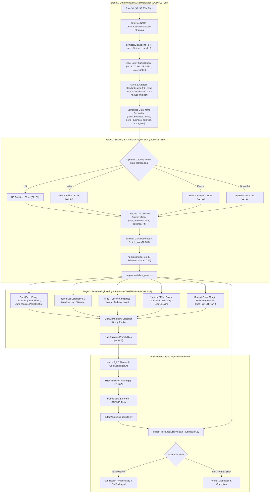

# Technical Implementation Plan: Business Entity Resolution
**Amazon ML Challenge 2026**  
**Track:** Machine Learning / Natural Language Processing / Large-Scale Data Matching  
**Document Version:** 1.1.0 (Production Execution & Architecture Status)

---

## 1. Executive Overview & Problem Formulation

### 1.1 Problem Definition
In enterprise commercial ecosystems, merchant and business entity profiles are ingested asynchronously from disparate, heterogeneously structured sources. In this competition:
* **Reference Source ($S_1$):** Deduplicated, canonical anchor source containing reference entities.
* **Target Sources ($S_2, S_3$):** Independent, noisy target sources containing potential duplicate or fragmented records corresponding to $S_1$ entities.

The objective is to map each reference record $e^{(1)}_i \in S_1$ to its true set of matching records $M(e^{(1)}_i) \subseteq S_2 \cup S_3$, where $|M(e^{(1)}_i)| \in \{0, 1, 2, \dots, K\}$.

```
S1 Reference Entity ──┬──> [No Match: 1-to-0 (Singleton)]
                      ├──> [Single Match: 1-to-1 in S2 or S3]
                      └──> [Multi-Match: 1-to-Many across S2 and S3]
```

### 1.2 Cardinality & Distribution Dynamics
1. **1-to-0 (Singletons):** A substantial fraction of $S_1$ records have **no corresponding entity** in either $S_2$ or $S_3$. Identifying singletons with zero false alarms is mathematically paramount under the competition's scoring metric.
2. **1-to-Many Matching:** When matches exist, a single $S_1$ entity can map to multiple records across $S_2$ and $S_3$ simultaneously (e.g., $S_2\text{-}00047, S_2\text{-}00193, S_3\text{-}00812$).
3. **Target Exclusivity:** Predictions for $e^{(1)}_i$ must **only** contain identifiers prefixed with `S2-` or `S3-`. Self-matching (`S1-` IDs) or predicting IDs outside the test corpus results in immediate validation penalties or disqualification.

### 1.3 Open-Set Country Semantics & Cross-Country Invariance
The dataset provides a categorical field `country`. 
* **Training Corpus:** Contains records from $\mathcal{C}_{train} = \{\text{'US'}, \text{'India'}\}$.
* **Test Corpus:** Contains records from $\mathcal{C}_{test} = \{\text{'US'}, \text{'India'}, \text{'France'}\}$.

```
  ┌──────────────────────────────────────────────────────────────────┐
  │                    CRITICAL DOMAIN AXIOMS                       │
  ├──────────────────────────────────────────────────────────────────┤
  │ 1. Intra-Country Invariance: A business entity in Country A never │
  │    matches a business entity in Country B.                       │
  │ 2. Open-Set Zero-Hardcoding: 'France' records must NOT be dropped│
  │    or misclassified by hard-coded category encoders. Handled     │
  │    purely dynamically via dynamic partition discovery.          │
  │ 3. Universal Preprocessing: Normalizers must handle Latin/French │
  │    diacritics (e.g., 'École', 'Château', 'SARL', 'Boulevard')    │
  │    alongside US corporate forms and Indian regional addresses.   │
  └──────────────────────────────────────────────────────────────────┘
```

---

## 2. Evaluation Metric Dynamics: Macro $F_{0.5}$ & The Singleton Paradox

### 2.1 Mathematical Formulation of $F_{0.5}$
The competition is evaluated using the macro-averaged $F_\beta$ score with $\beta = 0.5$, which places **twice as much emphasis on Precision as on Recall**:

$$F_\beta = (1 + \beta^2) \frac{\text{Precision} \times \text{Recall}}{\beta^2 \cdot \text{Precision} + \text{Recall}}$$

Substituting $\beta = 0.5$ ($\beta^2 = 0.25$):

$$F_{0.5} = \frac{(1 + 0.25) \cdot P \cdot R}{0.25 \cdot P + R} = \frac{1.25 \cdot P \cdot R}{0.25 \cdot P + R} = \frac{5 \cdot P \cdot R}{P + 4 \cdot R}$$

Where for a specific $S_1$ entity $e_i$:
* Let $Y_i \subseteq S_2 \cup S_3$ be the ground truth set of matched entity IDs.
* Let $\hat{Y}_i \subseteq S_2 \cup S_3$ be the predicted set of matched entity IDs.
* True Positives: $\text{TP}_i = |Y_i \cap \hat{Y}_i|$
* False Positives: $\text{FP}_i = |\hat{Y}_i \setminus Y_i|$
* False Negatives: $\text{FN}_i = |Y_i \setminus \hat{Y}_i|$

$$\text{Precision}_i = \begin{cases} \frac{\text{TP}_i}{\text{TP}_i + \text{FP}_i} & \text{if } |\hat{Y}_i| > 0 \\ 1.0 & \text{if } |\hat{Y}_i| = 0 \text{ and } |Y_i| = 0 \\ 0.0 & \text{if } |\hat{Y}_i| = 0 \text{ and } |Y_i| > 0 \end{cases}$$

$$\text{Recall}_i = \begin{cases} \frac{\text{TP}_i}{\text{TP}_i + \text{FN}_i} & \text{if } |Y_i| > 0 \\ 1.0 & \text{if } |Y_i| = 0 \text{ and } |\hat{Y}_i| = 0 \\ 0.0 & \text{if } |Y_i| = 0 \text{ and } |\hat{Y}_i| > 0 \end{cases}$$

The overall competition score is the unweighted arithmetic mean (Macro Average) over all $N$ entities in $S_1$:

$$\text{Macro } F_{0.5} = \frac{1}{N} \sum_{i=1}^{N} F_{0.5}(Y_i, \hat{Y}_i)$$

### 2.2 Asymmetric Penalty Dynamics (2x Precision Weight)
To see why False Merges are penalized 2x more severely than Missed Matches, observe the partial derivatives of $F_{0.5}$ with respect to $P$ and $R$:

$$\frac{\partial F_{0.5}}{\partial P} = \frac{20 R^2}{(P + 4R)^2} \quad \text{vs.} \quad \frac{\partial F_{0.5}}{\partial R} = \frac{5 P^2}{(P + 4R)^2}$$

At balanced operating points ($P \approx R$), $\frac{\partial F_{0.5}}{\partial P} = 4 \frac{\partial F_{0.5}}{\partial R}$. Any model decision that sacrifices precision to gain marginal recall causes a severe drop in the competition metric.

### 2.3 The Singleton Paradox
Consider an entity $e_k$ where the true set is empty ($Y_k = \emptyset$, singleton record):
1. **Correct Null Prediction ($\hat{Y}_k = \emptyset$):**
   $$P_k = 1.0, \quad R_k = 1.0 \implies F_{0.5}(e_k) = 1.0$$
2. **Spurious Prediction ($\hat{Y}_k = \{\text{S2-001}\}$):**
   $$\text{TP}_k = 0, \quad \text{FP}_k = 1 \implies P_k = 0.0, \quad R_k = 0.0 \implies F_{0.5}(e_k) = 0.0$$

```
┌────────────────────────────────────────────────────────────────────────┐
│                        THE SINGLETON CLIFF                             │
│                                                                        │
│   Predicting Empty (Correct)     ───>  Score Contribution = +1.000     │
│   Predicting 1 False Match       ───>  Score Contribution =  0.000     │
│                                                                        │
│   Net Impact of a Single False Merge on a Singleton: -1.0 PER ENTITY   │
└────────────────────────────────────────────────────────────────────────┘
```
**Strategic Consequence:** Threshold tuning must directly optimize macro $F_{0.5}$ rather than AUC-ROC or binary cross-entropy. The optimal classification probability threshold $\tau^*$ will naturally shift to a conservative, high-precision operating point ($\tau^* \in [0.65, 0.85]$).

---

## 3. End-to-End System Architecture

The end-to-end architecture decomposes the massive-scale matching problem into a Three-Stage Pipeline: **Deterministic Normalization (Completed)**, **High-Recall Sparse Blocking (Completed)**, and **Dense GBDT Pairwise Re-Ranking & Classification (In-Progress / Next Step)**.



---

## 4. Pipeline Execution Status & Stage Deep-Dives

### 4.1 Stage 1: Robust Text Normalization & Entity Canonicalization
* **Status:** `COMPLETED`  
* **Source Module:** [`code/business_entity_resolution/src/normalizer.py`](file:///c:/Users/rishu/Amazon%20ML/code/business_entity_resolution/src/normalizer.py)

Raw business records feature high degrees of orthographic variance, typographical errors, regional legal nomenclature, and inconsistent address sequencing. Stage 1 implements deterministic, memory-efficient string transformations applied via optimized list comprehensions.

#### 4.1.1 Implemented Cleaning Logic

1. **Unicode NFKD Decomposition & Accent Stripping:**
   * Uses `unicodedata.normalize("NFKD", text)` and discards combining diacritical marks (`not unicodedata.combining(c)`).
   * Strips French diacritics in the test set (e.g., `École` $\to$ `Ecole`, `Château` $\to$ `Chateau`, `Société` $\to$ `Societe`, `Hôtel` $\to$ `Hotel`) preserving phonetic stems.

2. **Symbol Replacements:**
   * `&` $\to$ `and`
   * `@` $\to$ `at`
   * `+` $\to$ `plus`
   * `[/\\_]` $\to$ ` ` (space)

3. **Legal Entity Suffix Stripping:**
   * Business names often differ only by regional or corporate forms. Suffixes are stripped using regex with word boundary matching `\b(suffix)\b` ordered by descending length to prevent partial collisions:
   * **Corporate forms matched:** `private limited`, `pvt ltd`, `incorporated`, `corporation`, `enterprises`, `associates`, `limited`, `company`, `pvt`, `ltd`, `inc`, `corp`, `llc`, `llp`, `sarl`, `sasu`, `eurl`, `sas`, `gmbh`, `sa`, `co`.

4. **Street & Address Standardization:**
   * Maps directional and road abbreviations using word boundary replacements:
     * Street Types: `rd` $\to$ `road`, `st` $\to$ `street`, `ave`/`av` $\to$ `avenue`, `blvd`/`bvd`/`bd` $\to$ `boulevard`, `dr` $\to$ `drive`, `ln` $\to$ `lane`, `ct` $\to$ `court`, `pkwy` $\to$ `parkway`, `pkg` $\to$ `parking`, `hwy` $\to$ `highway`, `rte` $\to$ `route`, `r` $\to$ `rue`.
     * Unit / Structure Tokens: `apt` $\to$ `apartment`, `flt` $\to$ `flat`, `ste` $\to$ `suite`, `bldg` $\to$ `building`, `fl` $\to$ `floor`, `h.no`/`hno` $\to$ `house number`, `b/h` $\to$ `behind`, `opp` $\to$ `opposite`, `nr` $\to$ `near`.
     * Cardinal Directions: `n` $\to$ `north`, `s` $\to$ `south`, `e` $\to$ `east`, `w` $\to$ `west`, `ne` $\to$ `northeast`, `nw` $\to$ `northwest`, `se` $\to$ `southeast`, `sw` $\to$ `southwest`.

5. **Punctuation & Whitespace Cleanup:**
   * Non-alphanumeric characters stripped via `[^a-z0-9\s]`.
   * Consecutive whitespace collapsed to a single space via `\s+` with `.strip()`.

6. **Vectorized DataFrame Processing (`normalize_dataframe`):**
   * Generates three canonical columns:
     * `norm_business_name`: Normalized business name string.
     * `norm_business_address`: Normalized business address string.
     * `norm_joint`: Concatenated `"{norm_business_name} {norm_business_address}"` used as primary blocking text.

---

### 4.2 Stage 2: Scalable Candidate Generation (Blocking)
* **Status:** `COMPLETED`  
* **Source Module:** [`code/business_entity_resolution/src/blocking.py`](file:///c:/Users/rishu/Amazon%20ML/code/business_entity_resolution/src/blocking.py)

#### 4.2.1 The Combinatorial Scaling Bottleneck
Evaluating pairwise similarity across the Cartesian product of $S_1 \times (S_2 \cup S_3)$ involves billions to trillions of comparisons:

$$\mathcal{O}(|S_1| \times (|S_2| + |S_3|)) \approx 10^{10} - 10^{13} \text{ pairs}$$

Blocking restricts candidate comparisons to the Top-$K$ ($K=35$) candidate target entities per $S_1$ record, achieving a **Reduction Ratio $> 99.99\%$** while preserving candidate recall.

#### 4.2.2 Implemented Blocking Architecture & Parameters

```
┌────────────────────────────────────────────────────────────────────────┐
│                   TF-IDF SPARSE BLOCKING PARAMETERS                    │
│                        (src/blocking.py)                               │
├────────────────────────────────────────────────────────────────────────┤
│ • Analyzer:              'char_wb' (word-boundary character n-grams)   │
│ • N-gram Range:          (3, 4)                                        │
│ • Sublinear TF:          True (1 + log(tf))                            │
│ • Min Document Freq:     2                                             │
│ • Max Features (Vocab):  250,000                                       │
│ • Storage Data Type:     np.float32 (L2-normalized)                    │
│ • Matrix Multiplication: Batched CSR Sparse Dot Product (Batch=10,000) │
│ • Candidate Selection:   np.argpartition Top-K (K=35)                  │
│ • Minimum Similarity:    tau_block >= 0.15                             │
└────────────────────────────────────────────────────────────────────────┘
```

1. **Dynamic Intra-Country Partitioning:**
   * Partitions $S_1$ and $(S_2 \cup S_3)$ strictly by `country`.
   * **Zero hardcoding:** Partitions are discovered dynamically via `source1_df["country"].dropna().unique()`. Handles `US`, `India`, and test-set `France` (or any unseen country partition) without manual adjustments.

2. **Batched Sparse Matrix Dot Product:**
   * Target TF-IDF matrix $X_{\text{target}}$ is fitted on $(S_2 \cup S_3)$ and transposed once into CSR format ($X_{\text{target}}^T$).
   * $S_1$ queries are chunked into batches of $10,000$ rows:
     $$\text{Sim}_{\text{batch}} = X_{S_1}[\text{batch}] \cdot X_{\text{target}}^T$$
   * Computations operate in CPU RAM without dense matrix inflation.

3. **Argpartition Top-K Selection:**
   * For each row, candidate indices are filtered by `sim >= 0.15`.
   * If valid candidates exceed $K=35$, `np.argpartition` extracts the top 35 candidates in $\mathcal{O}(N)$ time, followed by descending sort.

4. **Submission-Compliant Candidate Pairs Export (`export_candidate_pairs`):**
   * Output file: `output/candidate_pairs.tsv`
   * Schema: `source1_entity_id\tcandidate_entity_ids`
   * Guaranteed exact row-order match with `source1_df["entity_id"]`.
   * Comma-separated target IDs (`S2-xxx,S3-yyy`), empty string for singletons, zero quotes, zero spaces, and zero `S1-` self matches.

---

### 4.3 Stage 3: Feature Engineering, GBDT Classifier & Post-Processing
* **Status:** `IN-PROGRESS / NEXT STEP`  
* **Target Modules:** `src/features.py`, `src/train.py`, `src/threshold.py`, `src/predict.py`

Once candidate pairs $\mathcal{P} = \{(e^{(1)}_i, e^{(2/3)}_j)\}$ are generated by Stage 2, each pair is projected into a dense feature vector $\mathbf{x}_{ij} \in \mathbb{R}^D$ to train a gradient boosted tree that distinguishes true matches from high-similarity false matches.

#### 4.3.1 Pairwise Feature Engineering Suite

| Feature Category | Feature Name | Description & Mathematical Definition |
| :--- | :--- | :--- |
| **RapidFuzz Distances** | `levenshtein_sim` | Normalized Levenshtein ratio: $1 - \frac{\text{Lev}(s_1, s_2)}{\max(\|s_1\|, \|s_2\|)}$ |
| | `jaro_winkler_sim` | Jaro-Winkler prefix-weighted string metric ($p=0.1$) |
| | `partial_ratio` | RapidFuzz substring alignment similarity |
| **Token-Set Metrics** | `token_set_ratio` | Token set ratio (handles duplicate/reordered tokens) |
| | `token_sort_ratio` | Levenshtein similarity on alphabetically sorted tokens |
| | `token_jaccard` | Word token Jaccard similarity: $\frac{\|T_1 \cap T_2\|}{\|T_1 \cup T_2\|}$ |
| | `token_overlap_count`| Count of shared whitespace-delimited tokens |
| | `token_len_diff_ratio`| Disparity ratio: $\frac{\|\|T_1\| - \|T_2\|\|}{\max(\|T_1\|, \|T_2\|)}$ |
| **TF-IDF Similarities**| `name_tfidf_char_cos` | Character 3,4-gram TF-IDF cosine similarity on business names |
| | `name_tfidf_word_cos` | Word unigram/bigram TF-IDF cosine similarity on business names |
| | `addr_tfidf_word_cos` | Word TF-IDF cosine similarity on business addresses |
| | `joint_tfidf_cos` | Joint (Name + Address) TF-IDF cosine score from Stage 2 |
| **Numeric & PIN Tokens**| `exact_pin_match` | Binary flag: $1$ if numeric PIN/postal tokens match exactly, $0$ otherwise |
| | `pin_mismatch` | Binary flag: $1$ if both have postal digits but they differ |
| | `digit_jaccard` | Jaccard similarity computed solely over extracted numeric digit tokens |
| | `has_house_no_match` | Binary flag indicating identical house/building/unit number |
| **Rank & Score Margins**| `candidate_rank` | Ordinal rank ($1, 2, \dots, 35$) assigned during Stage 2 blocking |
| | `top1_sim_diff` | Margin gap: $\text{Sim}(e_i, e_j) - \max_{k \neq j} \text{Sim}(e_i, e_k)$ |
| | `target_source_type` | Indicator flag: $0$ for `S2-` entity, $1$ for `S3-` entity |

#### 4.3.2 LightGBM Classifier & Group Margin Optimization
* **Model Architecture:** `LightGBM` binary classifier / group ranker (`LGBMClassifier` / `LGBMRanker`).
* **Objective:** Binary Log-Loss with scale positive weight adjustment / focal weighting:
  $$\mathcal{L} = -\sum_{(i,j)} \left[ y_{ij} \log(p_{ij}) + \gamma (1 - y_{ij}) \log(1 - p_{ij}) \right]$$
* **Hyperparameters:**
  * `learning_rate`: $0.03 - 0.05$
  * `num_leaves`: $63 - 127$
  * `max_depth`: $8 - 12$
  * `min_child_samples`: $50$
  * `colsample_bytree`: $0.80$
  * `subsample`: $0.85$

---

### 4.4 Stage 4: Threshold Optimization & Final Post-Processing

#### 4.4.1 Direct Macro $F_{0.5}$ Threshold Search
Because false positive matches destroy the $+1.0$ score contribution for singletons, we tune a global threshold $\tau^*$ via grid search over out-of-fold validation predictions to directly maximize Macro $F_{0.5}$:

```python
def optimize_macro_f05(y_true_dict, candidate_df, prob_col="pred_prob"):
    """
    Direct grid search over probability cutoff tau to maximize Macro F_0.5.
    y_true_dict: {s1_id: set(matched_ids)}
    candidate_df: DataFrame with ['s1_id', 'target_id', 'pred_prob']
    """
    best_f05 = -1.0
    best_tau = 0.5
    
    thresholds = np.linspace(0.40, 0.90, 51)
    for tau in thresholds:
        matched_preds = (
            candidate_df[candidate_df[prob_col] >= tau]
            .groupby("s1_id")["target_id"]
            .apply(set)
            .to_dict()
        )
        f05_scores = []
        for s1_id, true_set in y_true_dict.items():
            pred_set = matched_preds.get(s1_id, set())
            f05_scores.append(compute_entity_f05(true_set, pred_set))
        
        macro_score = float(np.mean(f05_scores))
        if macro_score > best_f05:
            best_f05 = macro_score
            best_tau = tau
            
    return best_tau, best_f05
```

---

## 5. Technical Stack & Governance

### 5.1 Technology Stack & Acceleration
* **Language & Runtime:** Python 3.10+ (64-bit)
* **High-Performance String Kernel:** `rapidfuzz` (C++ SIMD / AVX2 accelerated matching)
* **Sparse Matrix Computations:** `scipy.sparse` (CSR sparse dot products) & `scikit-learn` (`TfidfVectorizer`)
* **Vectorized Processing:** `pandas` & `numpy`
* **Gradient Boosting:** `lightgbm` (multi-threaded OpenMP)
* **Validation Suite:** Standalone local validator `student_resource/utils/validate_submission.py`

### 5.2 Hard Constraints & Compliance Verification

| Governance Rule | Constraint Requirement | Pipeline Verification Strategy |
| :--- | :--- | :--- |
| **Model Licensing** | Open-source (MIT / Apache 2.0) $\le$ 8B parameters | LightGBM and TF-IDF models strictly adhere to open-source licensing. |
| **External Data Lookup** | **STRICTLY PROHIBITED**: No external APIs, geocoders, or web queries | 100% self-contained preprocessing using regex patterns and internal corpus statistics. Zero external network calls. |
| **Open-Set Country Handling** | Dynamic handling of `France` in test set | Zero hardcoded `{US, India}` country filters; dynamic partition discovery ensures all test countries are indexed and matched. |
| **Output TSV Format** | Tab-separated (`.tsv`), UTF-8 encoded, exact column headers | Verified against `validate_submission.py` with zero syntax errors. |
| **Candidate Invariance** | Final matches $\subseteq$ Candidate pairs | Validated automatically before generating submission packages. |

### 5.3 Submission Validation Protocol
Before generating or uploading any submission artifact, execute the validation script:

```bash
python student_resource/utils/validate_submission.py \
    --matching output/matching_results.tsv \
    --candidate output/candidate_pairs.tsv \
    --test-dir student_resource/dataset/test
```

**Expected Exit Criteria:** Return Code `0` (`Validation Successful! PASS`).

---

## 6. Project Code Structure & Implementation Roadmap

### 6.1 Codebase Layout (`code/business_entity_resolution/`)

```
code/business_entity_resolution/
├── README.md                           # End-to-end execution guide
├── requirements.txt                    # Pinned production dependencies
└── src/
    ├── __init__.py                     # Package init
    ├── normalizer.py                   # [COMPLETED] Unicode NFKD, Legal Suffix, Address Expansions
    ├── blocking.py                     # [COMPLETED] TF-IDF char_wb (3,4) Sparse Blocking & TSV Export
    ├── features.py                     # [IN-PROGRESS] RapidFuzz, Token-Set, PIN, & TF-IDF Features
    ├── train.py                        # [IN-PROGRESS] 5-Fold LightGBM Classifier & Group Ranker
    ├── threshold.py                    # [IN-PROGRESS] Macro F_0.5 Grid Search Optimizer
    └── pipeline.py                     # Master execution entry point
```

### 6.2 Implementation Roadmap

| Milestone | Stage Description | Status | Key Deliverable |
| :--- | :--- | :--- | :--- |
| **Phase 1** | Text Normalization & Canonicalization | `COMPLETED` | [`normalizer.py`](file:///c:/Users/rishu/Amazon%20ML/code/business_entity_resolution/src/normalizer.py) |
| **Phase 2** | Country-Partitioned TF-IDF Sparse Blocking | `COMPLETED` | [`blocking.py`](file:///c:/Users/rishu/Amazon%20ML/code/business_entity_resolution/src/blocking.py), `output/candidate_pairs.tsv` |
| **Phase 3** | RapidFuzz Feature Extraction & LightGBM Model | `IN-PROGRESS` | `src/features.py`, `src/train.py` |
| **Phase 4** | Macro $F_{0.5}$ Threshold Tuning for Singletons | `NEXT STEP` | `src/threshold.py` |
| **Phase 5** | Test Inference & `validate_submission.py` Check | `NEXT STEP` | `output/matching_results.tsv`, zip package |
