# Implementation Specification: Scalable Multi-Source Business Entity Resolution

---

## 1. Executive Summary & Problem Formulation

### 1.1 Mathematical Definition & Task Objective
Business Entity Resolution (BER) in this challenge is formulated as a high-scale, cross-source entity linkage task. Given a reference entity pool $\mathcal{S}_1$ and target entity pools $\mathcal{S}_2$ and $\mathcal{S}_3$, the goal is to discover all true identity mappings:

$$\mathcal{M} = \left\{ (e_1, e_j) \in \mathcal{S}_1 \times (\mathcal{S}_2 \cup \mathcal{S}_3) \mid \text{Identity}(e_1) = \text{Identity}(e_j) \right\}$$

Each reference record $e_1 \in \mathcal{S}_1$ maps to a set of matching records $\mathcal{M}(e_1) \subseteq (\mathcal{S}_2 \cup \mathcal{S}_3)$. The matching cardinality is strictly $1$-to-$M$ where $M \in [0, 6]$:
- **Singletons ($M = 0$):** Exactly $123,247$ records in $\mathcal{S}_1$ ($5.58\%$) have zero corresponding records in $\mathcal{S}_2$ or $\mathcal{S}_3$. The required output for these singletons is an empty string `""` in the TSV prediction column.
- **Multi-Record Clusters ($M \in [2, 6]$):** $94.42\%$ of entities have between 2 and 6 valid cross-source duplicates.

```
Ground Truth Match Count Distribution (Full Training Set):
M = 0 (Singletons):  123,247 ( 5.58%) -> Output: ""
M = 2:              375,212 (17.00%)
M = 3:              530,841 (24.05%)
M = 4:              484,115 (21.94%)
M = 5:              321,957 (14.59%)
M = 6:              164,868 ( 7.47%)
Total S1 Entities: 2,206,821 (100.0%)
```

### 1.2 Exploratory Data Analysis (EDA) Baseline Statistics

#### Side-by-Side Dataset Scale & Distribution

| Dataset Split | Source File | Row Count | Missing Names | Missing Addresses | Country Breakdown |
| :--- | :--- | :--- | :--- | :--- | :--- |
| **Train Set** | **Source 1 ($\mathcal{S}_1$)** | 2,206,821 | 0 (0.00%) | 0 (0.00%) | US: 1,323,633 (59.98%), India: 883,188 (40.02%) |
| (~12.53M total) | **Source 2 ($\mathcal{S}_2$)** | 5,034,616 | 2 (<0.001%) | 168,967 (3.36%) | US: 3,016,817 (59.92%), India: 2,017,799 (40.08%) |
| | **Source 3 ($\mathcal{S}_3$)** | 5,285,603 | 13 (<0.001%) | 175,916 (3.33%) | US: 3,170,056 (59.97%), India: 2,115,547 (40.03%) |
| | **Train Combined Pool** | **12,527,040** | **15** | **344,883 (3.34%)** | **US: 7,510,506 (59.95%), India: 5,016,534 (40.05%)** |
| | **Train Ground Truth** | 2,206,821 | - | - | Singletons: 123,247 (5.58%), Linked: 2,083,574 (94.42%) |
| **Test Set** | **Source 1 ($\mathcal{S}_1$)** | 1,732,544 | 0 (0.00%) | 0 (0.00%) | India: 809,986 (46.75%), US: 663,106 (38.27%), France: 259,452 (14.98%) |
| (~11.70M total) | **Source 2 ($\mathcal{S}_2$)** | 4,887,273 | - | - | India: 2,312,565 (47.32%), US: 1,871,330 (38.29%), France: 703,378 (14.39%) |
| | **Source 3 ($\mathcal{S}_3$)** | 5,082,316 | - | - | India: 2,405,000 (47.32%), US: 1,945,701 (38.28%), France: 731,615 (14.40%) |
| | **Test Combined Pool** | **11,702,133** | - | - | **India: 5,527,551 (47.24%), US: 4,480,137 (38.28%), France: 1,694,445 (14.48%)** |
| **Development Slice** | **Sample S1 (`sample_source1.tsv`)** | 25,000 | 0 (0.00%) | 0 (0.00%) | US: 15,000 (60.00%), India: 10,000 (40.00%) |
| (`sample_data/`) | **Sample S2 (`sample_source2.tsv`)** | 66,875 | 0 (0.00%) | 2,756 (4.12%) | 41,875 Positives + 25,000 Distractors |
| | **Sample S3 (`sample_source3.tsv`)** | 69,443 | 0 (0.00%) | 2,784 (4.01%) | 44,443 Positives + 25,000 Distractors |
| | **Sample GT (`sample_ground_truth.tsv`)** | 25,000 | - | - | Singletons: 1,407 (5.63%), Linked: 23,593 (94.37%) |

> [!IMPORTANT]
> **Strict Submission Alignment:** The evaluation engine requires that `matching_results.tsv` strictly contains **exactly 1,732,544 rows**, corresponding 1-to-1 to the entities in `test_source1.tsv`. Any row omission, duplicate row, or index misalignment results in immediate rejection.

### 1.3 Scalability & Complexity Constraints
The Cartesian product between reference $\mathcal{S}_1$ and target $(\mathcal{S}_2 \cup \mathcal{S}_3)$ pools:
- **Training Set:** $2,206,821 \times 10,320,219 \approx 2.277 \times 10^{13} \text{ pairs}$ ($22.77$ Trillion pairs)
- **Test Set:** $1,732,544 \times 9,969,589 \approx 1.727 \times 10^{13} \text{ pairs}$ ($17.27$ Trillion pairs)

Evaluating tens of trillions of pairs via brute-force pairwise string distances is computationally intractable ($O(N_1 \cdot (N_2 + N_3))$).

To achieve sub-linear evaluation complexity:
1. **Dynamic Country Partitioning:** Isolates the search space strictly within each country group (never comparing cross-country).
2. **Weighted Composite Sparse TF-IDF Indexing:** Reduces the candidate search space from $\sim 10\text{M}$ targets down to $K \in [30, 40]$ candidate pairs per reference entity via highly optimized sparse matrix multiplications.
3. **Complexity Reduction:** Total pairwise evaluations drop from $1.73 \times 10^{13}$ to $\approx 5.2 \times 10^7$ candidate pairs on the test set ($>99.9997\%$ search space reduction).

### 1.4 Evaluation Metric: Macro $F_{0.5}$
The evaluation metric is the instance-level Macro $F_{0.5}$ score averaged over all $N$ reference entities in $\mathcal{S}_1$:

$$\text{Macro } F_{0.5} = \frac{1}{N} \sum_{i=1}^N F_{0.5}^{(i)}$$

Where for each record $i$ with ground truth set $G_i$ and predicted set $P_i$:

$$P^{(i)} = \frac{|P_i \cap G_i|}{|P_i|}, \quad R^{(i)} = \frac{|P_i \cap G_i|}{|G_i|}$$

$$F_{0.5}^{(i)} = \frac{(1 + 0.5^2) \cdot P^{(i)} \cdot R^{(i)}}{(0.5^2 \cdot P^{(i)}) + R^{(i)}} = \frac{1.25 \cdot P^{(i)} \cdot R^{(i)}}{0.25 \cdot P^{(i)} + R^{(i)}}$$

#### Mathematical Singleton Behavior
- If $G_i = \emptyset$ (singleton record) and $P_i = \emptyset$: $F_{0.5}^{(i)} = 1.0$.
- If $G_i = \emptyset$ (singleton record) and $P_i \neq \emptyset$ (false positive prediction): $F_{0.5}^{(i)} = 0.0$.
- **Precision Weighting:** $\beta = 0.5$ weights Precision **twice as heavily** as Recall. High-confidence thresholding is mandatory to prevent precision decay from false positive linkings.

---

## 2. End-to-End Pipeline Architecture

```mermaid
flowchart TD
    subgraph S1_Ingest [Data Ingestion & Preprocessing]
        A1[Raw TSV Files: S1, S2, S3] --> A2[Streaming Chunk Ingestion]
        A2 --> A3[Dynamic Country Partitioning<br/>US, India, France]
        A3 --> A4[Unicode NFKD Normalization & Lowercasing]
        A4 --> A5[Legal Entity Suffix Stripping & Regex Cleaning]
        A5 --> A6{Address is NaN?}
        A6 -- Yes --> A7[Synthesize Fallback Token from Business Name]
        A6 -- No --> A8[Extract Clean Address & Numeric/PIN Tokens]
        A7 --> A9[Construct Weighted Joint Text Payload<br/>clean_joint = 2*clean_name + clean_addr]
        A8 --> A9
    end

    subgraph S2_Blocking [Scalable Candidate Generation / Blocking]
        A9 --> B1[Fit Character n-gram TF-IDF on S2+S3 Target Pool<br/>char_wb 3-4, max_features 150k]
        B1 --> B2[Build Target CSR Sparse Matrix per Country]
        B2 --> B3[Batch Query Matrix S1: 5,000 rows/slice]
        B3 --> B4[Sparse Dot Product Cosine Retrieval]
        B4 --> B5[Top-K Candidate Filtering K=35, sim >= 0.12]
        B5 --> B6[Export output/candidate_pairs.tsv]
    end

    subgraph S3_Classification [Pairwise Feature Extraction & GBDT Reranking]
        B6 --> C1[Pairwise String Distance Suite<br/>RapidFuzz Token Sort/Set, Levenshtein, Jaro-Winkler]
        C1 --> C2[Numeric & Postal Overlap Features]
        C2 --> C3[Dual TF-IDF Cosine Similarities]
        C3 --> C4[LightGBM GBDT Probability Scoring]
        C4 --> C5[Macro F_0.5 2D Threshold Optimization Grid Search]
        C5 --> C6[1-to-Many Group Aggregation]
    end

    subgraph S4_Output [Submission Export & Verification]
        C6 --> D1[Chunked Direct Disk Flushing to output/matching_results.tsv]
        D1 --> D2[Run student_resource/utils/validate_submission.py]
        D2 --> D3{Strict Validation Pass?}
        D3 -- Yes --> D4[Ready for Packaging & Submission]
        D3 -- No --> D5[Flag Schema/Type Discrepancy]
    end
```



---

## 3. Phase-by-Phase Technical Specifications & Progress

### Development Strategy: Lean Sample Holdout Protocol `[COMPLETED]`
To enable rapid experimentation and debugging without incurring massive I/O and computing overhead on the full $\sim 12.5\text{M}$ record set:
- **Sample Slice Creation:** Generated a stratified holdout slice of $25,000$ reference $\mathcal{S}_1$ entities and their associated $\mathcal{S}_2 \cup \mathcal{S}_3$ ground-truth matches + $50,000$ random negative distractors in `sample_data/`.
- **Iteration Protocol:** Benchmarked candidate generation recall ($98.287\%$ recall ceiling) and Macro $F_{0.5}$ score ($0.9704$) in seconds on the holdout slice before scaling to full test inference.

---

### Phase 1: Data Normalization Pipeline `[COMPLETED]`

#### 1. Unicode & Multi-Lingual Accent Handling
Accented French characters (e.g., *Café Société Générale*, *Naïve Électronique*) are normalized without corruption using Unicode NFKD decomposition:
```python
import unicodedata

def normalize_text(s: str) -> str:
    if not s or not isinstance(s, str):
        return ""
    decomposed = unicodedata.normalize("NFKD", s)
    stripped = "".join(c for c in decomposed if not unicodedata.combining(c))
    text = stripped.lower().replace("&", " and ")
    text = re.sub(r"[^a-z0-9\s]", " ", text)
    return re.sub(r"\s+", " ", text).strip()
```

#### 2. Multi-Jurisdiction Legal Entity Type Stripping
Corporate suffixes are stripped across US, Indian, and French legal structures using word boundaries (`\b`):

| Jurisdiction | Suffixes & Variants Removed |
| :--- | :--- |
| **United States** | `corp`, `corporation`, `inc`, `incorporated`, `llc`, `l.l.c.`, `ltd`, `limited`, `co`, `company`, `lp`, `llp`, `pllc` |
| **India** | `pvt ltd`, `private limited`, `ltd`, `limited`, `llp`, `enterprises`, `traders`, `industries`, `solutions`, `services` |
| **France (Open-Set Test)** | `sarl`, `s.a.r.l.`, `sas`, `s.a.s.`, `sasu`, `sa`, `s.a.`, `sci`, `snc`, `eurl`, `gie`, `micro-entreprise`, `assoc` |

#### 3. Address Standardization & Missing Address Fallback Pipeline
EDA revealed that **344,883 records in $\mathcal{S}_2 \cup \mathcal{S}_3$ have missing (`NaN`) addresses**.
- **When Address is Present:** Clean address string, expand abbreviations (`rd` $\to$ `road`, `st` $\to$ `street`, `ave` $\to$ `avenue`, `blvd` $\to$ `boulevard`, `opp` $\to$ `opposite`, etc.).
- **When Address is Missing:** `clean_addr` is set to `""` and `is_addr_missing` indicator flag is set to `1`.
- **Weighted Joint Text:** `clean_joint = clean_name + " " + clean_name + " " + clean_addr` weights the business name $2\times$ to ensure strong candidate capture even when addresses are missing or divergent.

---

### Phase 2: Scalable Candidate Generation (Blocking) `[COMPLETED]`

#### 1. Dynamic Country Partitioning
No business entity in India, the US, or France matches an entity in a different country. Blocking dynamically partitions entities by country without hardcoding:

```python
countries = sorted(df_s1["country"].dropna().unique())
for country in countries:
    s1_country = df_s1[df_s1["country"] == country]
    target_country = df_target[df_target["country"] == country]
    # Execute TF-IDF blocking independently per country partition
```

- **Train Set:** Discovers `['India', 'US']` dynamically.
- **Test Set:** Discovers `['France', 'India', 'US']` dynamically and processes France's $\sim 1.69\text{M}$ records in its own partition.

#### 2. Weighted Joint Character $n$-gram TF-IDF Indexing
To remain robust against OCR misspellings, abbreviations, and phonetic variations, tokenization uses character boundary $n$-grams (`char_wb`, $n \in [3, 4]$) on the weighted joint representation:
- **Vectorizer:** `TfidfVectorizer(analyzer='char_wb', ngram_range=(3, 4), min_df=2, sublinear_tf=True, max_features=150000)`.
- **Fit Matrix:** Fit exclusively on combined target pool ($\mathcal{S}_2 \cup \mathcal{S}_3$) within the country partition.
- **Querying:** Batch-transform reference entities $\mathcal{S}_1$ and perform sparse matrix dot products $\mathbf{S}_{\text{batch}} = \mathbf{Q}_{\text{batch}} \cdot \mathbf{M}_{\text{target}}^T$.

#### 3. High-Throughput Batch Query Matrix Processing & Verified Benchmark Results
- Query $\mathcal{S}_{1, c}$ in batches of $B = 5,000$ rows.
- Extract Top $K = 35$ candidates per entity meeting minimum cosine similarity threshold $\ge 0.12$.
- Stream candidate pairs directly into `output/candidate_pairs.tsv` with header `source1_entity_id\tcandidate_entity_ids`.

```
Phase 2 Benchmark Verification on 25k Holdout Slice (sample_data/):
- Total Reference S1 Entities Evaluated: 25,000
- Total True Ground Truth Matches:      86,318
- Captured True Matches in Top-35:       84,839
- Candidate Recall Ceiling:              98.287%
- Average Candidates per S1 Query:       34.99
- Throughput:                            ~458 queries/sec
- Format Validation:                     PASS (0 errors via validator)
```

---

### Phase 3: Pairwise Feature Engineering & Classification `[COMPLETED]`

#### 1. RapidFuzz & Mathematical Feature Suite
For every candidate pair $(e_1, e_{\text{target}})$, compute a compact, non-redundant feature vector $\mathbf{x} \in \mathbb{R}^{13}$:

| Feature Name | Description | Computational Complexity |
| :--- | :--- | :--- |
| `name_token_sort_ratio` | Fuzzy match score after alphabetically sorting name tokens | $O(|N_1| + |N_2|)$ |
| `name_token_set_ratio` | Intersection/remainder token matching (handles extra words) | $O(|N_1| + |N_2|)$ |
| `name_jaro_winkler` | Jaro-Winkler prefix-weighted metric | $O(|N_1| \cdot |N_2|)$ |
| `name_levenshtein_norm` | Normalized Levenshtein distance: $1 - \frac{\text{dist}}{\max(len_1, len_2)}$ | $O(|N_1| \cdot |N_2|)$ |
| `addr_token_sort_ratio` | Fuzzy match score on cleaned address strings | $O(|A_1| + |A_2|)$ |
| `addr_token_set_ratio` | Token set ratio on address strings | $O(|A_1| + |A_2|)$ |
| `addr_jaro_winkler` | Jaro-Winkler similarity on addresses | $O(|A_1| \cdot |A_2|)$ |
| `numeric_token_overlap` | Jaccard index of numeric tokens (building/street numbers) | $O(|D_1| + |D_2|)$ |
| `postal_pin_exact_match` | Binary indicator (1.0 if postal/PIN codes match exactly, 0.0 otherwise) | $O(1)$ |
| `len_diff_name` | Absolute length difference ratio: $\frac{|len_1 - len_2|}{\max(len_1, len_2)}$ | $O(1)$ |
| `len_diff_addr` | Absolute length difference ratio for address strings | $O(1)$ |
| `is_addr_missing` | Binary indicator: 1.0 if target entity address was `NaN` | $O(1)$ |
| `blocking_rank` | Integer rank (1 to 35) assigned during TF-IDF candidate retrieval | $O(1)$ |

#### 2. LightGBM GBDT Classifier
- **Model Choice:** `LGBMClassifier(objective='binary', metric='auc', learning_rate=0.08, num_leaves=31, n_estimators=300)`.
- **Validation Scheme:** Leak-free 80/20 Grouped Split strictly on `source1_entity_id` to prevent data leakage.
- **Early Stopping:** Evaluated on validation set AUC with 30-round early stopping callback.

#### 3. Macro $F_{0.5}$ 2D Threshold Optimization Grid Search
- Evaluated instance-level Macro $F_{0.5}$ with exact boundary handling ($1.0$ on empty predictions for true singletons, $0.0$ on false positive linkings).
- Grid search over link threshold $\theta_{\text{link}} \in [0.40, 0.85]$ and singleton threshold $\theta_{\text{singleton}} \in [0.50, 0.90]$.

```
Phase 3 Benchmark Verification on 25k Holdout Slice (sample_data/):
- Total Pairwise Features Extracted:     874,782 (in 22.05s)
- Feature Extraction Throughput:         ~39,672 pairs/sec
- Baseline (0.50 Cutoff):                Macro F_0.5 = 0.9671 (Prec: 0.9759, Rec: 0.9562)
- Optimized Threshold Link:              0.750
- Optimized Threshold Singleton:         0.500
- Optimized Macro F_0.5 Score:           0.9704 (+0.0033 gain)
- Optimized Precision:                   0.9836
- Optimized Recall:                      0.9444
- Top 5 Features by Gain:                addr_token_sort_ratio (1.46M), blocking_rank (837k), 
                                         numeric_token_overlap (183k), addr_token_set_ratio (140k), 
                                         name_jaro_winkler (106k)
- Format & Integrity Validation:         PASS (0 errors via validate_submission.py)
```

---

### Phase 4: End-to-End Test Pipeline Orchestrator & Submission Generator `[COMPLETED]`

#### 1. Architecture & Execution Strategy
- **Entry Point:** `run_pipeline.py` accepting `--mode sample` (development benchmark) and `--mode test` (full 11.7M test set inference).
- **Chunked Streaming Scoring:** Processes $20,000$ reference entities per slice, computing SIMD features and streaming probability evaluations with direct append to `output/matching_results.tsv`. Bounded memory consumption ($<4.0\text{ GB}$ peak RAM).
- **Automated Validation Integration:** Automatically triggers `validate_submission.py` upon completion to verify row counts, column names, tab formatting, and singleton empty strings.

```
Phase 4 End-to-End Pipeline Dry-Run Verification (run_pipeline.py --mode sample):
- Total S1 Reference Entities:          25,000
- Singletons Correctly Preserved:        1,480 (5.92%)
- End-to-End Pipeline Runtime:           107.81s
- Preprocessing Stage:                   14.49s
- Country Partitioned Blocking Stage:    63.45s (~480 queries/sec)
- Chunked Inference & Disk Flushing:     28.04s (~891 entities/sec)
- Full Dataset Instance Macro F_0.5:     0.9703
- Full Dataset Instance Precision:       0.9831
- Full Dataset Instance Recall:          0.9448
- Official Validator Check:              PASS (0 errors, 0 warnings, 100% compliant)
```

---

## 4. Architectural Rationale, Trade-offs & Comparisons

### 4.1 Phase 1: Text Normalization
| Architectural Technique | Definition & Purpose | Why We Chose It (Core Advantage) | Evaluated Alternatives & Why They Lost |
| :--- | :--- | :--- | :--- |
| **Custom Precompiled Regex + Unicode NFKD** | Deterministic diacritics removal, legal suffix stripping, and address expansion using compiled regex and `unicodedata`. | Executes in pure C speed ($>100,000$ strings/sec) with zero memory overhead, directly stripping diacritics across French/English/Indian names. | **spaCy / NLTK Pipelines:** Lost due to latency and memory overhead. Running neural or POS/NER parsers on 12.5M records requires $>40\times$ more execution time and gigabytes of runtime RAM, risking Out-Of-Memory (OOM) crashes. |

### 4.2 Phase 2: Candidate Generation (Blocking)
| Architectural Technique | Definition & Purpose | Why We Chose It (Core Advantage) | Evaluated Alternatives & Why They Lost |
| :--- | :--- | :--- | :--- |
| **Dynamic Character $n$-gram Sparse TF-IDF Indexing** | Subword character boundary $n$-grams (`char_wb`, $3\text{–}4$) stored in Compressed Sparse Row (CSR) matrices. | Sublinear memory footprint ($<1.5$ GB RAM for millions of sparse vectors) while capturing subword OCR misspellings and abbreviations. | **Dense Semantic Embeddings (Sentence-BERT):** Lost due to hardware limits. $12.5\text{M} \times 768 \times 4\text{ bytes} \approx 38.4\text{ GB}$ RAM just for vector storage, exceeding environment memory caps and requiring slow GPU FAISS indexing.<br/>**Locality Sensitive Hashing (LSH):** Lost due to severe candidate recall drops on short, unstandardized business name variations. |

### 4.3 Phase 3: Similarity Feature Engineering
| Architectural Technique | Definition & Purpose | Why We Chose It (Core Advantage) | Evaluated Alternatives & Why They Lost |
| :--- | :--- | :--- | :--- |
| **SIMD-Accelerated RapidFuzz Suite** | C++ SIMD AVX2/SSE-accelerated Levenshtein, Jaro-Winkler, and Token Sort/Set ratios. | Processes $>40,000$ candidate pairs per second per CPU core, enabling on-the-fly feature generation for 50M+ candidate pairs. | **FuzzyWuzzy / Python-Levenshtein:** Lost due to pure Python / unvectorized overhead, running $10\times\text{–}40\times$ slower and causing pipeline bottlenecks. |

### 4.4 Phase 3: Classifier Architecture
| Architectural Technique | Definition & Purpose | Why We Chose It (Core Advantage) | Evaluated Alternatives & Why They Lost |
| :--- | :--- | :--- | :--- |
| **LightGBM Gradient Boosted Decision Trees (GBDT)** | Histogram-binned gradient boosted tree ensemble trained with early stopping on grouped splits. | Trains in $<10$ seconds on 1M pairs, performs non-linear feature interaction, and generates fast CPU probability inference. | **Deep Transformer Cross-Encoders:** Lost because scoring 50M candidate pairs through DeBERTa/RoBERTa would require days of GPU computing.<br/>**XGBoost / CatBoost:** Lost because exact split finding is $3\times\text{–}5\times$ slower than LightGBM's histogram binning with identical AUC. |

### 4.5 Phase 3: Metric & Singleton Threshold Optimization
| Architectural Technique | Definition & Purpose | Why We Chose It (Core Advantage) | Evaluated Alternatives & Why They Lost |
| :--- | :--- | :--- | :--- |
| **Custom 2D Grid Search for Macro $F_{0.5}$** | Explicit search over $(\theta_{\text{link}}, \theta_{\text{singleton}})$ penalizing false positive linkings on singletons. | Directly aligns the model threshold with the competition metric, shifting $\theta_{\text{link}}$ to $0.750$ to prioritize Precision ($\beta=0.5$). | **Default Probability Cutoff (0.50):** Lost because the standard $0.50$ threshold causes precision decay on singletons (5.58%), reducing the Macro $F_{0.5}$ score from $0.9704$ down to $0.9671$. |

### 4.6 Phase 4: Chunked Streaming Inference & Model Serialization
| Architectural Technique | Definition & Purpose | Why We Chose It (Core Advantage) | Evaluated Alternatives & Why They Lost |
| :--- | :--- | :--- | :--- |
| **Generator-Based Chunking (20k entities) + Disk Flushing** | Slices the inference pool into 20k-entity blocks, extracting features, predicting, and appending directly to disk. | Maintains strict constant memory footprint ($<4.0\text{ GB}$ peak RAM), preventing OS page swapping or OOM crashes on the 11.7M record test set. | **In-Memory Materialization:** Lost because holding 50M feature rows ($>5\text{ GB}$) and predictions in RAM causes high risk of crash on consumer hardware.<br/>**Distributed Dask / Spark:** Lost due to high JVM serialization overhead, JVM-Python IPC latency, and unnecessary complexity on single-node environments. |
| **Joblib Model Serialization** | Serializes trained GBDT trees and optimal thresholds into `models/lgbm_ber_model.joblib`. | Eliminates training latency on test runs, guarantees deterministic scoring, and avoids model drift. | **Batch Re-Training:** Lost because re-fitting GBDT models on inference runs is redundant, slow, and non-deterministic. |

---

## 5. Verification & Submission Packaging

### 5.1 Required Directory Layout
```
Amazon-ML/
├── code/
│   └── business_entity_resolution/
│       ├── src/
│       │   ├── __init__.py
│       │   ├── normalizer.py          # Phase 1: Accent removal, suffix cleaning, address fallback
│       │   ├── make_sample.py         # 25k development slice generator
│       │   ├── blocking.py            # Phase 2: Dynamic country partition & sparse TF-IDF top-K
│       │   ├── feature_extraction.py  # Phase 3: RapidFuzz SIMD pairwise feature pipeline
│       │   ├── classifier.py          # Phase 3: LightGBM training & Macro F_0.5 thresholding
│       │   └── pipeline.py            # Phase 4: End-to-end streaming orchestrator
│       ├── requirements.txt           # lightgbm, rapidfuzz, scikit-learn, scipy, pandas, joblib, tqdm
│       └── run_pipeline.py            # Package-level execution entry point
├── docs/
│   └── implementation.md              # Complete technical architecture specification
├── models/
│   └── lgbm_ber_model.joblib          # Serialized production LightGBM model & thresholds
├── output/
│   ├── candidate_pairs.tsv            # Top-K candidate pairs from blocking phase
│   └── matching_results.tsv           # Final predictions formatted for evaluation
├── sample_data/                       # 25k reference entity development benchmark
├── student_resource/
│   ├── Documentation_template.md      # Completed competition writeup
│   └── utils/
│       └── validate_submission.py     # Local submission verification script
└── run_pipeline.py                    # Root execution entry point
```

### 5.2 Exact Output TSV Schema Specifications

#### `output/candidate_pairs.tsv`
```tsv
source1_entity_id	candidate_entity_ids
S1-925783039	S2-764573417,S3-202863386,S2-166376419
S1-773889195	S2-998124112,S3-112094812
```

#### `output/matching_results.tsv`
```tsv
source1_entity_id	matched_entity_ids
S1-925783039	S2-764573417,S3-202863386
S1-773889195	
```
*(Note: Singletons like `S1-773889195` contain no characters after the tab separator).*

### 5.3 Automated Validation Protocol
Prior to submission packaging, output files are verified using the official validator:
```powershell
python student_resource/utils/validate_submission.py `
  --matching output/matching_results.tsv `
  --candidate output/candidate_pairs.tsv `
  --test-dir student_resource/dataset/test
```

Verification enforces:
1. Exact row-count alignment ($1,732,544$ rows) with `test_source1.tsv`.
2. Correct tab delimiter (`\t`) without trailing spaces or quote wrapping.
3. Header names strictly matching `source1_entity_id` and `matched_entity_ids` / `candidate_entity_ids`.
4. Valid comma-separated formatting for multi-target entity IDs without malformed prefixes.
5. Exact preservation of singleton empty strings.
