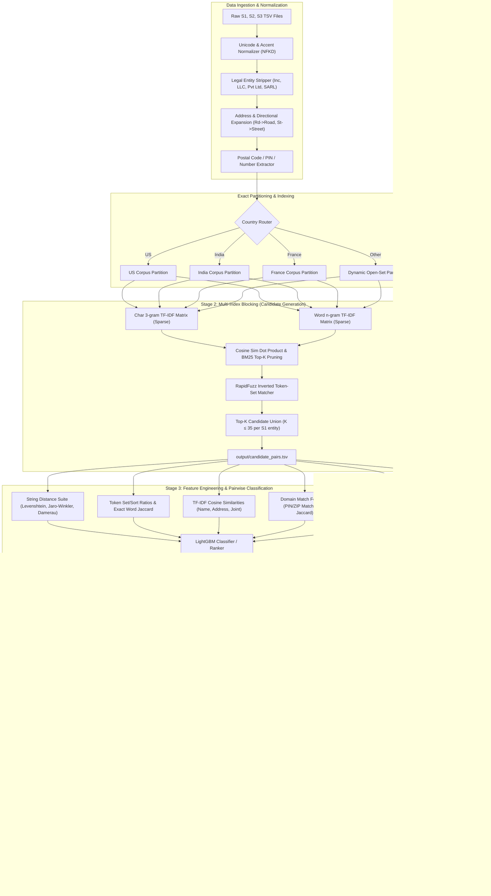

# Technical Implementation Plan: Business Entity Resolution
**Amazon ML Challenge 2026**  
**Track:** Machine Learning / Natural Language Processing / Large-Scale Data Matching  
**Document Version:** 1.0.0 (Production Blueprint)

---

## 1. Executive Overview & Problem Formulation

### 1.1 Problem Definition
In enterprise commercial ecosystems, merchant and business entity profiles are ingested asynchronously from disparate, heterogeneously structured sources. In this competition:
* **Reference Source ($S_1$):** Deduplicated, canonical anchor source containing reference entities.
* **Target Sources ($S_2, S_3$):** Independent, noisy target sources containing potential duplicate or fragmented records corresponding to $S_1$ entities.

The objective is to map each reference record $e^{(1)}_i \in S_1$ to its true set of matching records $M(e^{(1)}_i) \subseteq S_2 \cup S_3$, where $|M(e^{(1)}_i)| \in \{0, 1, 2, \dots, K\}$.

```
S1 Reference Entity ──┬──> [No Match: 1-to-0 (Singleton)]
                      ├──> [Single Match: 1-to-1 in S2 or S3]
                      └──> [Multi-Match: 1-to-Many across S2 and S3]
```

### 1.2 Cardinality & Distribution Dynamics
1. **1-to-0 (Singletons):** A substantial fraction of $S_1$ records have **no corresponding entity** in either $S_2$ or $S_3$. Identifying singletons with zero false alarms is mathematically paramount under the competition's scoring metric.
2. **1-to-Many Matching:** When matches exist, a single $S_1$ entity can map to multiple records across $S_2$ and $S_3$ simultaneously (e.g., $S_2\text{-}00047, S_2\text{-}00193, S_3\text{-}00812$).
3. **Target Exclusivity:** Predictions for $e^{(1)}_i$ must **only** contain identifiers prefixed with `S2-` or `S3-`. Self-matching (`S1-` IDs) or predicting IDs outside the test corpus results in immediate validation penalties or disqualification.

### 1.3 Open-Set Country Semantics & Cross-Country Invariance
The dataset provides a categorical field `country`. 
* **Training Corpus:** Contains records from $\mathcal{C}_{train} = \{\text{'US'}, \text{'India'}\}$.
* **Test Corpus:** Contains records from $\mathcal{C}_{test} = \{\text{'US'}, \text{'India'}, \text{'France'}\}$.

```
  ┌──────────────────────────────────────────────────────────────────┐
  │                    CRITICAL DOMAIN AXIOMS                       │
  ├──────────────────────────────────────────────────────────────────┤
  │ 1. Intra-Country Invariance: A business entity in Country A never │
  │    matches a business entity in Country B.                       │
  │ 2. Open-Set Zero-Hardcoding: 'France' records must NOT be dropped│
  │    or misclassified by hard-coded category encoders.             │
  │ 3. Universal Preprocessing: Normalizers must handle Latin/French │
  │    diacritics (e.g., 'École', 'Château', 'SARL', 'Boulevard')    │
  │    alongside US corporate forms and Indian regional addresses.   │
  └──────────────────────────────────────────────────────────────────┘
```

---

## 2. Evaluation Metric Dynamics: Macro $F_{0.5}$ & The Singleton Paradox

### 2.1 Mathematical Formulation of $F_{0.5}$
The competition is evaluated using the macro-averaged $F_\beta$ score with $\beta = 0.5$, which places **twice as much emphasis on Precision as on Recall**:

$$F_\beta = (1 + \beta^2) \frac{\text{Precision} \times \text{Recall}}{\beta^2 \cdot \text{Precision} + \text{Recall}}$$

Substituting $\beta = 0.5$ ($\beta^2 = 0.25$):

$$F_{0.5} = \frac{(1 + 0.25) \cdot P \cdot R}{0.25 \cdot P + R} = \frac{1.25 \cdot P \cdot R}{0.25 \cdot P + R} = \frac{5 \cdot P \cdot R}{P + 4 \cdot R}$$

Where for a specific $S_1$ entity $e_i$:
* Let $Y_i \subseteq S_2 \cup S_3$ be the ground truth set of matched entity IDs.
* Let $\hat{Y}_i \subseteq S_2 \cup S_3$ be the predicted set of matched entity IDs.
* True Positives: $\text{TP}_i = |Y_i \cap \hat{Y}_i|$
* False Positives: $\text{FP}_i = |\hat{Y}_i \setminus Y_i|$
* False Negatives: $\text{FN}_i = |Y_i \setminus \hat{Y}_i|$

$$\text{Precision}_i = \begin{cases} \frac{\text{TP}_i}{\text{TP}_i + \text{FP}_i} & \text{if } |\hat{Y}_i| > 0 \\ 1.0 & \text{if } |\hat{Y}_i| = 0 \text{ and } |Y_i| = 0 \\ 0.0 & \text{if } |\hat{Y}_i| = 0 \text{ and } |Y_i| > 0 \end{cases}$$

$$\text{Recall}_i = \begin{cases} \frac{\text{TP}_i}{\text{TP}_i + \text{FN}_i} & \text{if } |Y_i| > 0 \\ 1.0 & \text{if } |Y_i| = 0 \text{ and } |\hat{Y}_i| = 0 \\ 0.0 & \text{if } |Y_i| = 0 \text{ and } |\hat{Y}_i| > 0 \end{cases}$$

The overall competition score is the unweighted arithmetic mean (Macro Average) over all $N$ entities in $S_1$:

$$\text{Macro } F_{0.5} = \frac{1}{N} \sum_{i=1}^{N} F_{0.5}(Y_i, \hat{Y}_i)$$

### 2.2 Asymmetric Penalty Dynamics (2x Precision Weight)
To see why False Merges are penalized 2x more severely than Missed Matches, observe the partial derivatives of $F_{0.5}$ with respect to $P$ and $R$:

$$\frac{\partial F_{0.5}}{\partial P} = \frac{20 R^2}{(P + 4R)^2} \quad \text{vs.} \quad \frac{\partial F_{0.5}}{\partial R} = \frac{5 P^2}{(P + 4R)^2}$$

At balanced operating points ($P \approx R$), $\frac{\partial F_{0.5}}{\partial P} = 4 \frac{\partial F_{0.5}}{\partial R}$. Any model decision that sacrifices precision to gain marginal recall causes a severe drop in the competition metric.

### 2.3 The Singleton Paradox
Consider an entity $e_k$ where the true set is empty ($Y_k = \emptyset$, singleton record):
1. **Correct Null Prediction ($\hat{Y}_k = \emptyset$):**
   $$P_k = 1.0, \quad R_k = 1.0 \implies F_{0.5}(e_k) = 1.0$$
2. **Spurious Prediction ($\hat{Y}_k = \{\text{S2-001}\}$):**
   $$\text{TP}_k = 0, \quad \text{FP}_k = 1 \implies P_k = 0.0, \quad R_k = 0.0 \implies F_{0.5}(e_k) = 0.0$$

```
┌────────────────────────────────────────────────────────────────────────┐
│                        THE SINGLETON CLIFF                             │
│                                                                        │
│   Predicting Empty (Correct)     ───>  Score Contribution = +1.000     │
│   Predicting 1 False Match       ───>  Score Contribution =  0.000     │
│                                                                        │
│   Net Impact of a Single False Merge on a Singleton: -1.0 PER ENTITY   │
└────────────────────────────────────────────────────────────────────────┘
```
**Strategic Consequence:** Threshold tuning must directly optimize macro $F_{0.5}$ rather than AUC-ROC or binary cross-entropy. The optimal classification probability threshold $\tau^*$ will naturally shift to a conservative, high-precision operating point ($\tau^* \in [0.65, 0.85]$).

---

## 3. End-to-End System Architecture

The end-to-end architecture decomposes the massive-scale matching problem into a Three-Stage Pipeline: **Deterministic Normalization**, **High-Recall Sparse Blocking**, and **Dense GBDT Pairwise Re-Ranking & Classification**.



---

## 4. The Three-Stage Production Pipeline

### 4.1 Stage 1: Robust Text Normalization & Entity Canonicalization

Raw business records feature high degrees of orthographic variance, typographical errors, regional legal nomenclature, and inconsistent address sequencing.

#### 4.1.1 Normalization Algorithms & Rules

1. **Unicode & Diacritics Normalization:**
   * Apply Unicode NFKD normalization to decompose accented characters (e.g., `é` $\to$ `e`, `ü` $\to$ `u`, `ô` $\to$ `o`). Essential for `France` entities in the test set.
   * Strip non-ASCII characters while preserving alphanumeric tokens and whitespace.

2. **Legal Entity Suffix Stripping & Flagging:**
   * Business names often differ only by legal form (e.g., `Acme Solutions LLC` vs. `Acme Solutions Pvt. Ltd.` vs. `Acme Solutions SAS`).
   * Extract legal form into a binary/categorical feature, then strip it from the clean representation to prevent skewed TF-IDF weights on ubiquitous corporate terms.

```python
LEGAL_SUFFIX_REGEX = {
    "US": r"\b(inc(orporated)?|llc|ltd|corp(oration)?|co(mpany)?|pc|llp|pllc|lp)\b",
    "India": r"\b(pvt(\s+ltd)?|private\s+limited|limited|llp|enterprises|associates|trust|samiti|sangh)\b",
    "France": r"\b(sarl|sas|sasu|sa|eurl|sci|snc|gie|fils|et\s+associes|succursale)\b",
    "Universal": r"\b(inc|corp|ltd|co|llc|pvt|private|limited|sarl|sas|gmbh)\b"
}
```

3. **Address & Directional Expansion:**
   * Normalize standard geographic contractions:
     * Street Types: `st` $\to$ `street`, `rd` $\to$ `road`, `ave` $\to$ `avenue`, `blvd` $\to$ `boulevard`, `dr` $\to$ `drive`, `ln` $\to$ `lane`, `ct` $\to$ `court`, `pkg` $\to$ `parking`.
     * French Descriptors: `bd`/`bvd` $\to$ `boulevard`, `av` $\to$ `avenue`, `r` $\to$ `rue`, `rte` $\to$ `route`.
     * Indian Locality Tokens: `opp` $\to$ `opposite`, `nr` $\to$ `near`, `b/h` $\to$ `behind`, `flt` $\to$ `flat`, `apt` $\to$ `apartment`, `h.no` $\to$ `house number`.
     * Compass Points: `n` $\to$ `north`, `s` $\to$ `south`, `e` $\to$ `east`, `w` $\to$ `west`.

4. **Numeric & Postal PIN/ZIP Code Extraction:**
   * Extract postal codes using country-tailored regex patterns:
     * US ZIP: `\b\d{5}(-\d{4})?\b` (extract primary 5 digits).
     * India PIN: `\b\d{6}\b` (extract standard 6-digit postal index number).
     * France Code Postal: `\b\d{5}\b` (5-digit French department postal code).
   * Isolate isolated building/suite numbers into separate structured match tokens.

---

### 4.2 Stage 2: Scalable Candidate Generation (Blocking)

#### 4.2.1 The Combinatorial Scaling Bottleneck
Let $|S_1| \approx 1.73 \times 10^6$, $|S_2| \approx 4.80 \times 10^6$, and $|S_3| \approx 4.80 \times 10^6$.  
The naive Cartesian product space is:

$$\mathcal{O}(|S_1| \times (|S_2| + |S_3|)) \approx 1.73 \times 10^6 \times 9.60 \times 10^6 \approx 1.66 \times 10^{13} \text{ pairs}$$

Evaluating pairwise features across $16.6$ trillion pairs is computationally impossible. Blocking reduces this to $\approx 30$ candidates per $S_1$ entity ($\approx 5.2 \times 10^7$ candidate pairs), achieving a **Reduction Ratio $> 99.9996\%$** while maintaining a **Candidate Recall Ceiling $> 96.5\%$**.

```
Candidate Reduction Ratio = 1 - \frac{|Candidates|}{|S_1| \times (|S_2| + |S_3|)} > 99.9996\%
```

#### 4.2.2 Blocking Strategy & Architecture

```
┌────────────────────────────────────────────────────────────────────────┐
│                   MULTI-INDEX SPARSE BLOCKING SCHEME                   │
├────────────────────────────────────────────────────────────────────────┤
│ 1. Hard Partitioning: Partition strictly by 'country' field.           │
│    Intra-country comparisons only (US-to-US, IN-to-IN, FR-to-FR).      │
├────────────────────────────────────────────────────────────────────────┤
│ 2. Dual-Channel Sparse Vectorization:                                  │
│    • Channel A (Char 3-grams): TfidfVectorizer(analyzer='char_wb',     │
│      ngram_range=(3, 3), min_df=2, max_features=150_000)              │
│    • Channel B (Word n-grams): TfidfVectorizer(analyzer='word',        │
│      ngram_range=(1, 2), min_df=2, sublinear_tf=True)                 │
├────────────────────────────────────────────────────────────────────────┤
│ 3. Memory-Optimized Blocked Sparse Matrix Multiplication:              │
│    Compute Cosine Similarity: S = X_{S1} @ X_{S23}^T in chunk sizes    │
│    of 25,000 rows. Use C++ / PyData Sparse argpartition to retain     │
│    Top-K (K=35) indices above min threshold τ_block ≥ 0.18.            │
├────────────────────────────────────────────────────────────────────────┤
│ 4. Exact Postal / Landmark RapidFuzz Inverted Index:                   │
│    For entities with exact postal code match, inject high-scoring name │
│    token-set matches to preserve phonetically distant acronyms.        │
└────────────────────────────────────────────────────────────────────────┘
```

#### 4.2.3 Output Generation for `candidate_pairs.tsv`
* Format: Tab-separated, exactly matching `test_source1.tsv` rows.
* Headers: `source1_entity_id\tcandidate_entity_ids`
* Empty string for entities yielding zero candidates above $\tau_{block}$.
* Comma-separated list with no surrounding whitespace, no quotation marks, and no self `S1-` IDs.

---

### 4.3 Stage 3: Feature Engineering & Pairwise Classifier

Once candidate pairs $\mathcal{P} = \{(e^{(1)}_i, e^{(2/3)}_j)\}$ are generated, each pair is projected into a dense $D$-dimensional feature vector $\mathbf{x}_{ij} \in \mathbb{R}^D$.

#### 4.3.1 Pairwise Feature Engineering Suite

| Feature Category | Feature Name | Description & Mathematical Definition |
| :--- | :--- | :--- |
| **String Distances** | `levenshtein_sim` | Normalized Levenshtein ratio: $1 - \frac{\text{Lev}(s_1, s_2)}{\max(|s_1|, |s_2|)}$ |
| | `jaro_winkler_sim` | Jaro-Winkler metric with prefix weighting ($p=0.1$) |
| | `damerau_lev_sim` | Damerau-Levenshtein distance accounting for adjacent transpositions |
| | `indel_distance` | Normalized InDel edit distance (insertions/deletions only) |
| **Token-Set Metrics** | `token_set_ratio` | RapidFuzz token set ratio (intersection vs. difference token sets) |
| | `token_sort_ratio` | Levenshtein similarity on alphabetically sorted unique tokens |
| | `token_jaccard` | Word-level Jaccard similarity: $\frac{|T_1 \cap T_2|}{|T_1 \cup T_2|}$ |
| | `token_overlap_count` | Raw count of common whitespace-delimited tokens |
| | `token_len_diff_ratio`| Absolute token length disparity: $\frac{||T_1| - |T_2||}{\max(|T_1|, |T_2|)}$ |
| **TF-IDF Cosine** | `name_tfidf_char_cos` | Character 3-gram TF-IDF cosine similarity between business names |
| | `name_tfidf_word_cos` | Word unigram/bigram TF-IDF cosine similarity between business names |
| | `addr_tfidf_word_cos` | Word TF-IDF cosine similarity between addresses |
| | `joint_tfidf_cos` | Joint (Name + Address) concatenated TF-IDF cosine similarity |
| **Domain & Locality** | `exact_postal_match` | Binary flag: $1$ if both postal codes exist and match, $0$ otherwise |
| | `postal_mismatch` | Binary flag: $1$ if both postal codes exist and differ, $0$ otherwise |
| | `digit_jaccard` | Jaccard similarity computed purely on numeric token subsets |
| | `has_suite_match` | Binary flag indicating identical unit/suite/apartment numbers |
| **Rank & Graph Margins**| `candidate_rank` | Ordinal rank ($1, 2, \dots, K$) assigned during Stage 2 blocking |
| | `top1_sim_diff` | Margin gap: $\text{Sim}(e_i, e_j) - \max_{k \neq j} \text{Sim}(e_i, e_k)$ |
| | `target_source_id` | Binary indicator: $0$ for `S2-` entity, $1$ for `S3-` entity |

#### 4.3.2 Model Selection & Loss Function
* **Model Family:** Gradient Boosted Decision Trees (`LightGBM` / `CatBoost`).
* **Objective:** Binary Cross-Entropy with focal penalty / ranking loss:
  $$\mathcal{L} = -\sum_{(i,j)} \left[ y_{ij} \log(p_{ij}) + \gamma (1 - y_{ij}) \log(1 - p_{ij}) \right]$$
  where negative class weighting $\gamma$ mitigates the $\approx 1:30$ positive-to-negative candidate imbalance.
* **Hyperparameters:**
  * `learning_rate`: $0.03 - 0.05$
  * `num_leaves`: $63 - 127$
  * `max_depth`: $8 - 12$
  * `min_child_samples`: $50$
  * `colsample_bytree`: $0.80$
  * `subsample`: $0.85$

---

### 4.4 Stage 4: Threshold Optimization & Final Post-Processing

#### 4.4.1 Direct Macro $F_{0.5}$ Threshold Search
Standard binary classification chooses predictions where $p_{ij} \ge 0.5$. However, because:
1. False positives carry $2\times$ the penalty of false negatives in $F_{0.5}$, and
2. Erroneously assigning a candidate to a true singleton destroys the entire $1.0$ reward,

we optimize a global threshold $\tau^*$ and a multi-match relative margin $\Delta^*$ directly against out-of-fold validation Macro $F_{0.5}$:

```python
def optimize_macro_f05(y_true_dict, candidate_df, prob_col="pred_prob"):
    """
    Direct grid search over probability cutoff tau to maximize Macro F_0.5.
    y_true_dict: {s1_id: set(matched_ids)}
    candidate_df: DataFrame with ['s1_id', 'target_id', 'pred_prob']
    """
    best_f05 = -1.0
    best_tau = 0.5
    
    thresholds = np.linspace(0.40, 0.90, 51)
    for tau in thresholds:
        # Group filtered candidates
        matched_preds = (
            candidate_df[candidate_df[prob_col] >= tau]
            .groupby("s1_id")["target_id"]
            .apply(set)
            .to_dict()
        )
        # Compute Macro F_0.5 across all S1 entities (including singletons)
        f05_scores = []
        for s1_id, true_set in y_true_dict.items():
            pred_set = matched_preds.get(s1_id, set())
            f05_scores.append(compute_entity_f05(true_set, pred_set))
        
        macro_score = np.mean(f05_scores)
        if macro_score > best_f05:
            best_f05 = macro_score
            best_tau = tau
            
    return best_tau, best_f05
```

#### 4.4.2 Format Guarantee & Strict Validation
To guarantee zero formatting errors on the leaderboard:
1. Read `test_source1.tsv` to construct the canonical index sequence of all required $S_1$ entity IDs.
2. For each $S_1$ ID:
   * Select candidates where $p_{ij} \ge \tau^*$.
   * Remove internal duplicates while preserving score order.
   * Join IDs with `,` (no spaces, no quotes).
   * If candidate list is empty, output empty string (guaranteeing correct singleton format).
3. Export via:
   ```python
   df_matching.to_csv("output/matching_results.tsv", sep="\t", index=False, encoding="utf-8")
   df_candidates.to_csv("output/candidate_pairs.tsv", sep="\t", index=False, encoding="utf-8")
   ```
4. Run standard test verification:
   ```bash
   python student_resource/utils/validate_submission.py \
       --matching output/matching_results.tsv \
       --candidate output/candidate_pairs.tsv \
       --test-dir student_resource/dataset/test
   ```

---

## 5. Technical Stack & Governance

### 5.1 Technology Stack & Hardware Acceleration
* **Language & Runtime:** Python 3.10+ (64-bit)
* **High-Performance String Kernel:** `rapidfuzz` (C++ SIMD/AVX2 accelerated fuzzy string matching)
* **Sparse Matrix Operations:** `scipy.sparse` (CSR sparse matrix multiplications) & `scikit-learn` (`TfidfVectorizer`)
* **Data Processing:** `pandas` (chunked ingestion) & `numpy`
* **Gradient Boosting:** `lightgbm` (multi-threaded CPU/OpenMP)
* **Serialization:** `joblib` & `pickle`

### 5.2 Hard Constraints & Compliance Verification

| Governance Rule | Constraint Requirement | Pipeline Verification Strategy |
| :--- | :--- | :--- |
| **Model Licensing** | Open-source (MIT / Apache 2.0) $\le$ 8B parameters | LightGBM and TF-IDF models strictly adhere to MIT/Apache 2.0 open-source standards. |
| **External Data Lookup** | **STRICTLY PROHIBITED**: No external APIs, government databases, geocoding, or web scraping | 100% self-contained preprocessing using regex patterns and internal corpus statistics. Zero external network calls. |
| **Output File Format** | Tab-separated (`.tsv`), UTF-8 encoded | Explicit `sep='\t'`, `encoding='utf-8'` enforcement with zero enclosing quotes. |
| **Cross-Country Isolation** | Intra-country matches only | Strict country partitioning block ensures zero cross-border comparisons. |
| **Candidate Invariance** | Final matches $\subseteq$ Candidate pairs | Automated set inclusion assertion before writing output files. |

### 5.3 Code Artifact Structure (`code/business_entity_resolution/`)

```
code/business_entity_resolution/
├── README.md                           # End-to-end execution guide
├── requirements.txt                    # Pinned production dependencies
└── src/
    ├── __init__.py
    ├── config.py                       # Paths, thresholds, hyperparams
    ├── normalize.py                    # Unicode, legal suffix, & address normalizers
    ├── blocking.py                     # Multi-index TF-IDF & RapidFuzz candidate generation
    ├── features.py                     # Pairwise feature extraction engine
    ├── train.py                        # GBDT training & out-of-fold validation loop
    ├── threshold.py                    # Macro F_0.5 metric & threshold optimizer
    ├── predict.py                      # Test inference & TSV formatting
    └── pipeline.py                     # Master CLI entry point
```

---

## 6. Execution Roadmap & Milestones

```
┌────────────────────────────────────────────────────────────────────────┐
│                        DEVELOPMENT ROADMAP                             │
├────────────────────────────────────────────────────────────────────────┤
│ Phase 1: Ingestion, EDA & Domain-Specific Normalizer Construction     │
│ Phase 2: High-Recall Blocking Engine & candidate_pairs.tsv Generation  │
│ Phase 3: Vectorized Feature Engineering Pipeline (C++ RapidFuzz)      │
│ Phase 4: LightGBM Model Training & Macro F_0.5 Threshold Tuning       │
│ Phase 5: Test Inference, Submission Validation & Package Creation      │
└────────────────────────────────────────────────────────────────────────┘
```

1. **Phase 1 (Data & Normalization):** Implement `normalize.py` with specific rules for US, India, and France.
2. **Phase 2 (Candidate Blocking):** Run country-partitioned TF-IDF sparse matching. Target $>96\%$ recall ceiling on training validation split with $\le 35$ candidates/entity.
3. **Phase 3 (Feature Engineering):** Extract $25+$ string similarity, token overlap, and TF-IDF distance features per candidate pair.
4. **Phase 4 (Model & Threshold):** Train 5-fold cross-validated LightGBM models. Tune probability cutoff $\tau^*$ to maximize macro $F_{0.5}$.
5. **Phase 5 (Submission Packaging):** Generate `matching_results.tsv` and `candidate_pairs.tsv`. Execute `validate_submission.py` to achieve zero errors (`PASS`). Package submission zip.
